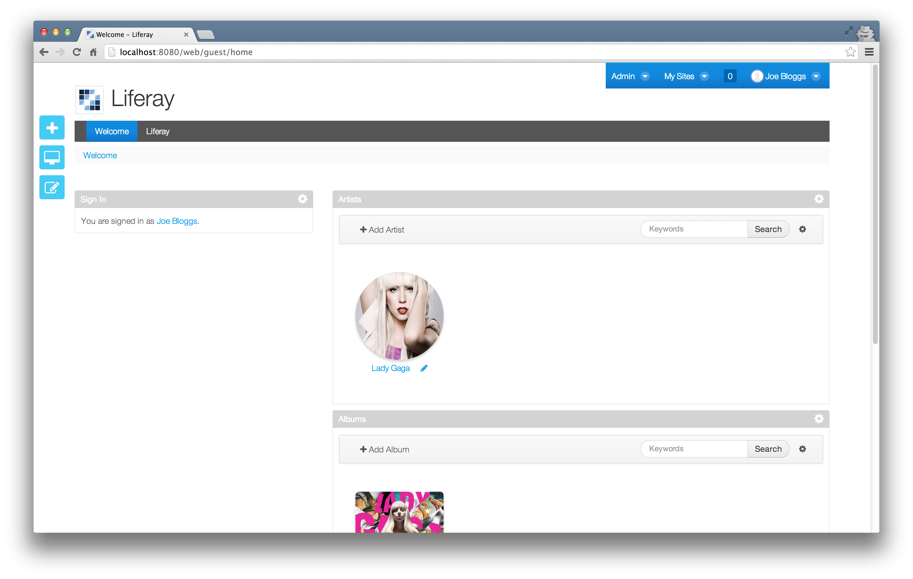
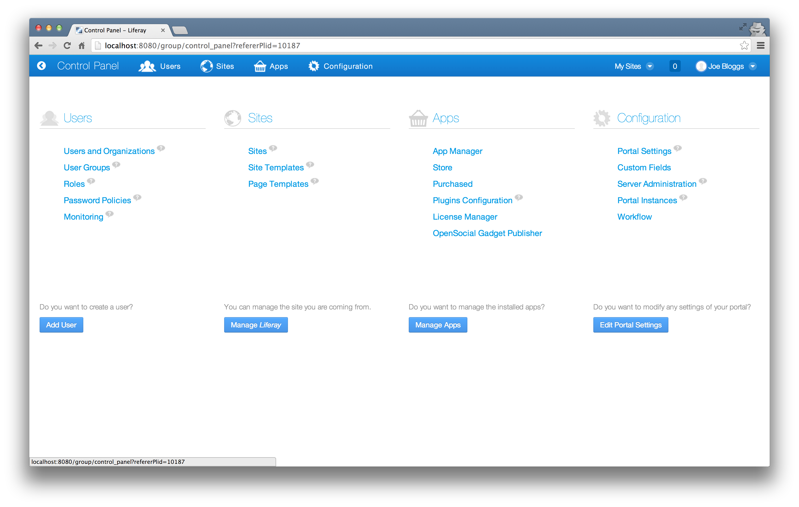
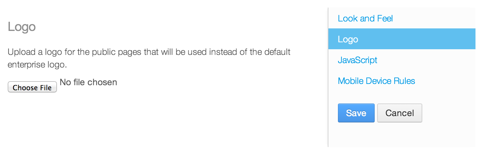
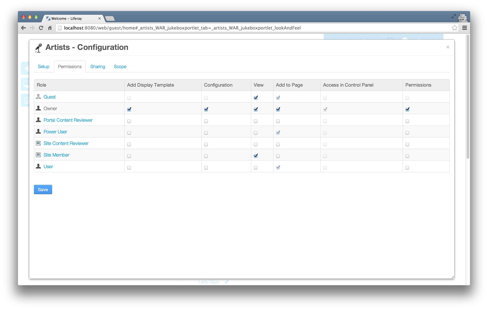
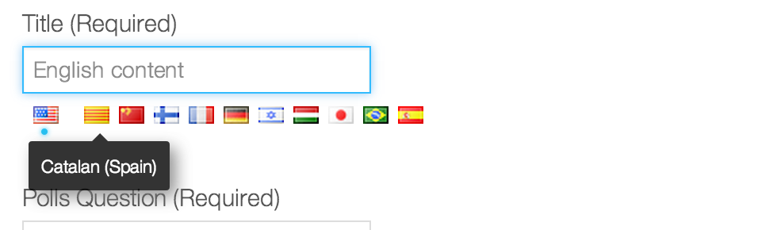
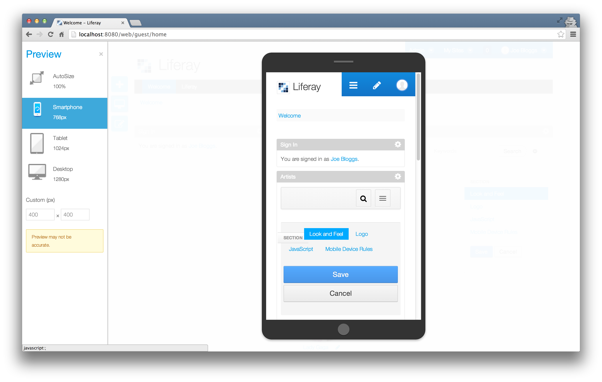
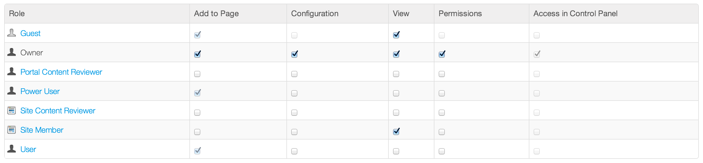
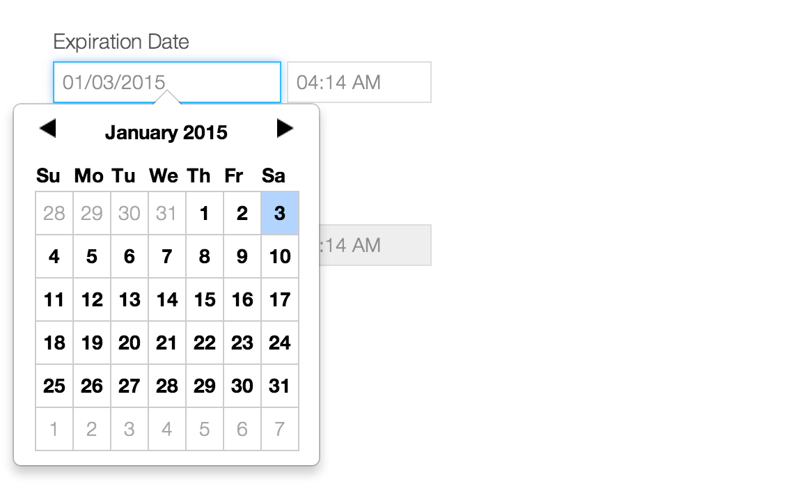
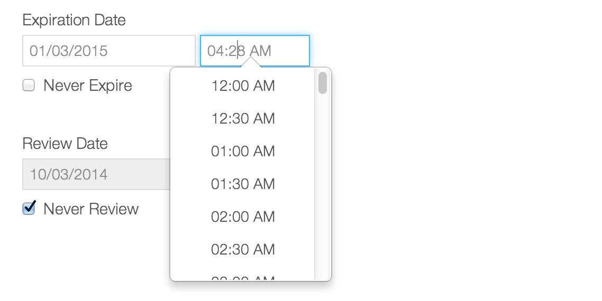

# AlloyUI

## What is AlloyUI?

AlloyUI is an open source front-end framework built on top of [Yahoo! User Interface Library (YUI)](http://yuilibrary.com).
It leverages all of YUI's modules and adds even more cutting edge components and features to help you build terrific UIs.
* AlloyUI 2.0 incorporates [Twitter Bootstrap's](http://liferay.github.io/alloy-bootstrap) look & feel and use its HTML/CSS powerful capabilities.
* With AlloyUI you can create modern UI components that provide a consistent look & feel across Liferay Portal.
* It is also server-agnostic, which means that you can use it with any technology.


## Why AlloyUI?

* Given the popularity of jQuery, you may be wondering why Liferay chose to build on YUI instead of jQuery.
* Well, Liferay v5.0.x used jQuery and our UI Team already contributed to its core, so what's the reason?
* While jQuery is great for small websites, once you start creating high scalable applications like Java portals you'll need a more robust solution.

> You can still use jQuery or any other JavaScript library in Liferay Portal, but we strongly recommend you to use AlloyUI, since it's integrated with everything. If you use another library, there are chances of your page load slower as it will still load AlloyUI and also need to load your other library.

## Who is using AlloyUI?

* Liferay
* Sesame Street
* Lufthansa
* Cisco
* Marines


## What is YUI?

The Yahoo! User Interface Library (YUI) is an open-source JavaScript library for building richly interactive web applications using techniques such as Ajax, DHTML, and DOM scripting.


## Why YUI?

* AlloyUI was built on YUI for several reasons. First, YUI facilitates building high quality production-level widgets quickly.
* YUI has an elegant architecture that is very flexible and easy to extend.
* It lends itself for using in small scale as well as large scale projects.

## Who is using YUI?

* Yahoo!
* Flickr
* Walmart
* NFL


## Project Structure


File                | Description
:------------------ | :-------------------------------------------------------------
``demos``           | Contains basic examples of the AlloyUI modules.
``build``           | Contains AlloyUI and YUI generated files, once build task has been run. However, this directory is unnecessary for versioning, so it is ignored (.gitignore).
``src``             | Contains the source code of the AlloyUI modules.
``tasks``           | Contains the source code of the Grunt tasks.
``.alloy.json``     | Specifies all dependencies and some configurations.
``.editorconfig``   | Specifies the coding style for different editors/IDEs
``.jsbeautifyrc``   | Specifies the coding format rules for JSBeautify.
``.jshintrc``       | Specifies the linting configurations for JSHint.
``.yeti.json``      | Specifies the testing configurations for Yeti.
``CONTRIBUTING.md`` | Defines the contributing information for the project.
``LICENSE.md``      | Defines the license agreement for AlloyUI.
``README.md``       | Explains the AlloyUI project.
``package.json``    | Lists all NodeJS dependencies.

For more information visit [AlloyUI GitHub](http://github.com/liferay/alloy-ui) page.

## Who is behind AlloyUI?

### AlloyUI was created in 2009 by:

* Eduardo Lundgren (Brazil)
* Nate Cavanaugh (USA)

### Today there are more contributors, such as:

* Iliyan Peychev (Spain)
* Bruno Basto (Brazil)
* Zeno Rocha (Brazil)


# Liferay

## New features of Liferay UI

Liferay 6.2 brings a set of improvements to the usability and user interface. Several components were rethought, some of them were inherited from AlloyUI 2.0 and others were developed directly on the portal. Other noticeable features are changes in the control panel, the number of pop-ups were reduced and responsive web design support. All that to make the portal more usable and versatile and to allow it to keep growing without increasing the complexity. This tutorial will go through those changes, showing examples and screen-shots to show the end result.

> A good resource in order to have a deep understanding about all the technical changes that happened is to follow the original ticket story on Liferay's issue tracker [https://issues.liferay.com/browse/LPS-34012](https://issues.liferay.com/browse/LPS-34012).

### Twitter Bootstrap

Liferay provides support for [Twitter Bootstrap](http://liferay.github.io/alloy-bootstrap) CSS and HTML markup out of the box. The JavaScript to add behavior to the Bootstrap components are powered by [AlloyUI](http://http://alloyui.com) instead of jQuery. AlloyUI uses a 1:1 translation from Less to [Sass](http://sass-lang.com) available on [alloy-bootstrap](https://github.com/liferay/alloy-bootstrap) repository, also adds minimal extra style definitions for AlloyUI. Some of the benefits of using Bootstrap are:

* Themes built for Liferay can be based on Bootstrap themes. And there are quite a few of them: [wrapbootstrap](https://wrapbootstrap.com), [bootswatch](https://http://bootswatch.com).
* Portlet developers can use the Bootstrap mark-up and Bootstrap components to build a nice looking UI faster. That include using responsive layouts.
* Content authors can use Bootstrap mark-up and styles to create beautiful looking advanced content that looks nice and is consistent with the rest of the UI.

The ability to use Bootstrap for web content is actually a side effect of its use everywhere else, it's definitely a very useful side effect. Twitter Bootstrap already has good documentation that you can access following the links above. Any HTML markup can be copied from [Twitter Bootstrap](http://liferay.github.io/alloy-bootstrap) documentation page and pasted inside Liferay portlets or contents. This facilitates development process and gives security to all layers of developers, from the web designers to those who hates aligning pixels during development.

For instance, when creating a table in a web content, without Bootstrap capabilities it looks like this:

```html
<table border="1" cellpadding="1" cellspacing="1" style="width: 500px;">
```


With Bootstrap, the markup is simpler and produces a better result:


```html
<table class="table table-striped table-bordered">
```


Each of these values of the class attributes provides one feature:

* `table` sets the base styles
* `table-striped` colors alternative rows differently
* `table-bordered` draws the borders around the table

Bootstrap also provides nice effects for images: rounding the borders, making them a circle and adding a polaroid-like frame around it. In order to benefit from this you don't even need to edit the HTML.


* `img-rounded` for rounded corners
* `img-circle` to get an image with the shape of a circle
* `img-polaroid` to get a nice frame around the image

It's worth mentioning that, before you save the content, the WYSIWYG editor is not aware of Bootstrap, so just getting out of the "Source" mode won't be enough to preview your changes. What you can do is click the "Basic Preview" button at the top of the web content form. For more information check [this blog post](https://www.liferay.com/web/jorge.ferrer/blog/-/blogs/new-in-6-2-bootstrap-even-in-web-content) by Jorge Ferrer.

### Font awesome icons

TODO.

### Add panel

The new add panel now provides ability to add content, applications and pages from the same place.


> Add content panel: Lists all recent content and its previews, the user can drag and drop any of them to display on the portal.


> Add application panel: Lists all available portlets, the user can drag and drop any of them to display on the portal.


> Add page panel: Pages can be created from this panel, the page type and layout can be selected.

### Navbar

In order to standardize navigation through the portal, one of the new components put in place is the new `<aui:nav-bar>`, `<aui:nav>` and `<aui:nav-item>`. Navbars are responsive meta components that serve as navigation headers for your application or site.


```jsp
<aui:nav-bar>
    <aui:nav>
        <aui:nav-item href="http://liferay.com" label="Liferay website" selected='<%= true %>' />
    </aui:nav>
</aui:nav-bar>
```

> Reference [jukebox/blob/master/sdk/portlets/jukebox-portlet/docroot/html/artists/toolbar.jsp](https://github.com/eduardolundgren/jukebox/blob/master/sdk/portlets/jukebox-portlet/docroot/html/artists/toolbar.jsp)

Available `<aui:nav-bar>` options:

Option              | Description
:------------------ | :-----------------------------------------------------------------
``cssClass``        | The css class to be applied to the nav bar search wrapper element.
``id``              | A custom id to be applied on the nav bar search wrapper element.

Other options can be passed to `<aui:nav>`:

Option              | Description
:------------------ | :-----------------------------------------------------------------
``ariaLabel``       | W3C ARIA label for accessibility, see [ARIA States and Properties](www.w3.org/TR/wai-aria/states_and_properties).
``ariaRole``        | W3C ARIA role for accessibility, see [ARIA States and Properties](www.w3.org/TR/wai-aria/states_and_properties).
``collapsible``     | Add ability to be collapsed (and are toggleable) in mobile views and become horizontal as the available viewport width increases.
``cssClass``        | The css class to be applied to the nav bar search wrapper element.
``file``            | A custom file path to be used.
``icon``            | Icon to be displayed on the collapsible panel in order to toggle the view.
``id``              | A custom id to be applied on the nav bar search wrapper element.
``searchContainer`` | A SearchContainer instance.
``useNamespace``    | Whether will use the portlet namespace on the element.

Available `<aui:nav-item>` options:

Option                  | Description
:---------------------- | :-----------------------------------------------------------------
``anchorCssClass``      | The css class to be applied to the nav bar search anchor element.
``anchorData``          | Map object to be translated to HTML5 `data-` attributes to the anchor element.
``anchorId``            | A custom id to be applied on the nav bar search anchor element.
``ariaLabel``           | W3C ARIA label for accessibility, see [ARIA States and Properties](www.w3.org/TR/wai-aria/states_and_properties).
``ariaRole``            | W3C ARIA role for accessibility, see [ARIA States and Properties](www.w3.org/TR/wai-aria/states_and_properties).
``cssClass``            | The css class to be applied to the nav bar search wrapper element.
``data``                | Map object to be translated to HTML5 `data-` attributes to the wrapper element.
``dropdown``            | Whether can host nested nav items to be displayed as a dropdown menu.
``href``                | The href of the anchor element.
``iconCssClass``        | The icon css class to be displayed next to the label.
``id``                  | A custom id to be applied on the nav bar search wrapper element.
``label``               | The label of the nav item.
``localizeLabel``       | Whether the label should be localized.
``selected``            | Whether the nav item is selected.
``state``               | The state of the nav item, could be `active` or `selected`.
``title``               | The title of the anchor.
``toggle``              | Toggle dropdown menu visibility.
``useDialog``           | Open the anchor href inside a dialog.
``wrapDropDownMenu``    | Wraps dropdown menu with a `<ul>`.

### Navbar dropdown

A `<aui:nav-item>` can be nested in order to produce a dropdown menu, for instance:


```jsp
<aui:nav-bar>
    <aui:nav>
        <aui:nav-item label="Liferay website" dropdown='<%= true %>'>
            <aui:nav-item href="http://liferay.com" label="Liferay portal" />
            <aui:nav-item href="http://in.liferay.com" label="Liferay Social Office" />
        </aui:nav-item>
    </aui:nav>
</aui:nav-bar>
```

### Advanced search

The new UI of advanced search provides a faster way to expand the search options.


Like on previous versions of Liferay, this functionality uses a `<liferay-ui:search-toggle>` taglib. The search toggle taglib can be placed inside a `<aui:nav-bar>` wrapped by a `<aui:nav-bar-search>` outputting Bootstrap HTML markup in order to provide the look and feel shown above.

```jsp
<aui:nav-bar>
    <aui:nav-bar-search>
        <div class="form-search">
            <liferay-ui:search-toggle buttonLabel="search">
                <aui:fieldset>
                    <aui:input label="name" />
                    <aui:input name="bio" />
                </aui:fieldset>
            </liferay-ui:search-toggle>
        </div>
    </aui:nav-bar-search>
</aui:nav-bar>
```

> Reference [jukebox/blob/master/sdk/portlets/jukebox-portlet/docroot/html/artists/toolbar.jsp](https://github.com/eduardolundgren/jukebox/blob/master/sdk/portlets/jukebox-portlet/docroot/html/artists/toolbar.jsp)

Available `<aui:nav-bar-search>` options:

Option              | Description
:------------------ | :-----------------------------------------------------------------
``cssClass``        | The css class to be applied to the nav bar search wrapper element.
``id``              | A custom id to be applied on the nav bar search wrapper element.
``file``            | A custom file path to be used.
``searchContainer`` | A SearchContainer instance.

```jsp
<aui:nav-bar>
    <aui:nav-bar-search cssClass="pull-right" file="/html/portlet/directory/user_search.jsp" searchContainer="<%= userSearchContainer %>" />
</aui:nav-bar>
```

### Dockbar

Dockbar is a very important portlet for Liferay administrators and developers as it has been evolving by adding more and more features with every new version. All the markup of the Dockbar comes from the Dockbar portlet, on the new version of Liferay it got split into two sections, the first one (top left blue bar) contains navigation menus, the second (right center, the light blue bar) contains the Add, Mobile preview and Edit shortcuts.



> Keep in mind the two sections of Dockbar comes from the same portlet and share the same HTML markup, the split visual style is all done in CSS by the theme through defining `.dockbar-split` css class, see [https://github.com/liferay/liferay-portal/blob/master/portal-web/docroot/html/themes/classic/css/dockbar.css#L400](https://github.com/liferay/liferay-portal/blob/master/portal-web/docroot/html/themes/classic/css/dockbar.css#L400) for more information.

### Control panel

The Control Panel was introduced in Liferay 5.2 as a way to provide a central location to manage the whole portal, including all of its sites. Previously administrators had to build their own administration UI by manually adding portlets to pages. The goal was achieved with great success and almost all of the feedback has been very positive, although on the new version of Liferay the Control Panel was redesigned to make it more usable and versatile. The main changes were:

* Extract the "My Account" administration out of the Control Panel.
* Extract "Site Administration" outside of the Control Panel



### Form navigator

Form navigator provides ability to divide your content into sections. It uses Bootstrap tabs enhanced by AlloyUI JavaScript.



```jsp
<%
String[] categoryNames = new String[] {"Section"};
String[][] categorySections = { new String[] { "look-and-feel", "logo", "javascript", "mobile-device-rules" } };
%>

<liferay-ui:form-navigator
    categoryNames="<%= categoryNames %>"
    categorySections="<%= categorySections %>"
    jspPath="/html/portlet/jukebox/"
    showButtons="<%= true %>"
/>
```

Available `<liferay-ui:form-navigator>` options:

Option                  | Description
:---------------------- | :-----------------------------------------------------------------------------------------------------------------------------
``backURL``             | If the section redirects the page, this url will be used to be the destination when back button is clicked.
``categorySections``    | Divide the categories into sections.
``categoryNames``       | Name of the sections to display, each section name will match to a existing file into the `jspPath` folder.
``displayStyle``        | When `panel` is passed will display a panel style, otherwise displays like tabs.
``formName``            | The form name that wraps the form navigator.
``htmlBottom``          | HTML string to be placed on the bottom of the form navigator.
``htmlTop``             | HTML string to be placed on the top of the form navigator.
``jspPath``             | Path to be used as base path for the sections that requires server side. The file will match with the `categoriesName` value.
``showButtons``         | Whether submit and cancel buttons are shown.

### Modal

The previous Dialog of Liferay was totally revamped and now it is called Modal. It's based on [AlloyUI modal component](http://alloyui.com/examples/modal). In order to instantiate a new modal AlloyUI API could be used directly, although Liferay wraps some functionalities that are pretty handy, such as always keep the dialog maximized and centralized to the page. In order to inherit those presets available on Liferay we recommend to use `Liferay.Util.Window.getWindow`.



```js
iferay.Util.Window.getWindow({
    dialog: {
        centered: true,
        cssClass: 'jukebox-portlet',
        height: 300,
        modal: true,
        resizable: false,
        width: 500
    },
    title: Liferay.Language.get('my-portlet')
});
```
Available `Liferay.Util.Window.getWindow` options:

Option                         | Description
:----------------------------- | :----------------------------------------------------------------------
``dialog.autoHeight``          | Whether the modal should automatically fits vertically to the viewport.
``dialog.autoHeightRatio``     | Defines the ratio the modal height should take.
``dialog.autoSizeNode``        | The node used to defines the dimensions of the modal.
``dialog.autoWidth``           | Whether the modal should automatically fits horizontally to the viewport.
``dialog.autoWidthRatio``      | Defines the ratio the modal with should take.
``title``                      | The modal title.

> Note that Liferay Modal extends [AlloyUI modal component](http://alloyui.com/examples/modal), therefore all options from the core component are also available to the `dialog` configuration passed to this API.

### Input localized

A new localized input is also available with a more intuitive ans easy to use interface.



When your entity field is defined as localized on `META-INF/portal-model-hints.xml` the `<aui:input>` taglib detects that and the field will be rendered as a localized input.

```jsp
<aui:input name="title" />
```

### Mobile device preview

We cannot forget the importance of supporting mobile devices for the web portals. Liferay 6.2 comes with an awesome feature of mobile device preview. This feature helps the developer to perform a unit testing of the portal on different types of hand held devices like smart phones, tablets as well as desktop. This feature does not provide an accurate preview but at least major issues can be resolved before the portal is accessed.



### Search container

The search container feature is available since older Liferay versions and it is responsible for rendering tables using an easy API that integrates with the server side data. On Liferay 6.2 it was restyled and now uses Bootstrap table styles.



### Input date

The new input date is much more intuitive. It now allows the user to input dates in friendly way.



When your entity field is defined as type date on `META-INF/portal-model-hints.xml` the `<aui:input>` taglib detects that and the field will be rendered as a date input. Another way to instantiate input date field is using `<liferay-ui:input-date>` taglib.

```jsp
<liferay-ui:input-date
    dayParam="startDateDay"
    dayValue="5"
    disabled="<%= false %>"
    firstDayOfWeek="1"
    monthParam="startDateMonth"
    monthValue="5"
    name="startDate"
    yearParam="startDateYear"
    yearValue="2014"
/>
```

Available `<liferay-ui:input-date>` options:

Option             | Description
:----------------- | :----------------------------------------------------------------------
``cssClass``       | The css class to be applied to the nav bar search wrapper element.
``disabled``       | Whether the input date should be disabled.
``dayParam``       | Name of the day parameter sent to the server on submit the hosting form.
``dayParamId``     | Id of the day parameter sent to the server on submit the hosting form.
``dayValue``       | Value of the day.
``monthParam``     | Name of the month parameter sent to the server on submit the hosting form.
``monthParamId``   | Id of the month parameter sent to the server on submit the hosting form.
``monthValue``     | Value of the month.
``name``           | Name of the input that holds the friendly date.
``yearParam``      | Name of the year parameter sent to the server on submit the hosting form.
``yearParamId``    | Id of the year parameter sent to the server on submit the hosting form.
``yearValue``      | Value of the year.

### Input time

The new input time is much more intuitive. It now allows the user to input time in friendly way.



To instantiate input time field the `<liferay-ui:input-time>` taglib could be used.

```jsp
<liferay-ui:input-time
    amPmParam="startDateAmPm"
    amPmValue="<%= 0 %>"
    dateParam="startDateTime"
    dateValue="<%= new Date().getTime() %>"
    disabled="<%= false %>"
    hourParam="startDateHour"
    hourValue="10"
    minuteParam="startDateMinute"
    minuteValue="30"
    name="startTime"
/>
```

Available `<liferay-ui:input-time>` options:

Option              | Description
:------------------ | :----------------------------------------------------------------------
``amPmParam``       | Name of the amPm parameter sent to the server on submit the hosting form.
``amPmValue``       | Value of the amPm.
``cssClass``        | The css class to be applied to the nav bar search wrapper element.
``dateParam``       | Name of the date parameter sent to the server on submit the hosting form.
``dateValue``       | Value of the date.
``disabled``        | Whether the input date should be disabled.
``hourParam``       | Name of the hour parameter sent to the server on submit the hosting form.
``hourValue``       | Value of the hour.
``minuteInterval``  | Value of the amPm.
``minuteParam``     | Name of the minute parameter sent to the server on submit the hosting form.
``minuteValue``     | Value of the minute.
``name``            | Name of the input that holds the friendly date.

### Popover
### Application display templates
### Calendar
### Liferay panel
### Paginator
### Recycle bin
### Search container
### Tooltip