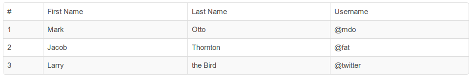

# AlloyUI

## What is AlloyUI?

AlloyUI is an open source front-end framework built on top of [Yahoo! User Interface Library (YUI)](http://yuilibrary.com).
It leverages all of YUI's modules and adds even more cutting edge components and features to help you build terrific UIs.
* AlloyUI 2.0 incorporates [Twitter Bootstrap's](http://liferay.github.io/alloy-bootstrap) look & feel and use its HTML/CSS powerful capabilities.
* With AlloyUI you can create modern UI components that provide a consistent look & feel across Liferay Portal.
* It is also server-agnostic, which means that you can use it with any technology.


## Why AlloyUI?

* Given the popularity of jQuery, you may be wondering why Liferay chose to build on YUI instead of jQuery.
* Well, Liferay v5.0.x used jQuery and our UI Team already contributed to its core, so what's the reason?
* While jQuery is great for small websites, once you start creating high scalable applications like Java portals you'll need a more robust solution.

> You can still use jQuery or any other JavaScript library in Liferay Portal, but we strongly recommend you to use AlloyUI, since it's integrated with everything. If you use another library, there are chances of your page load slower as it will still load AlloyUI and also need to load your other library.

## Who is using AlloyUI?

* Liferay
* Sesame Street
* Lufthansa
* Cisco
* Marines


## What is YUI?

The Yahoo! User Interface Library (YUI) is an open-source JavaScript library for building richly interactive web applications using techniques such as Ajax, DHTML, and DOM scripting.


## Why YUI?

* AlloyUI was built on YUI for several reasons. First, YUI facilitates building high quality production-level widgets quickly.
* YUI has an elegant architecture that is very flexible and easy to extend.
* It lends itself for using in small scale as well as large scale projects.

## Who is using YUI?

* Yahoo!
* Flickr
* Walmart
* NFL


## Project Structure


File                | Description
:------------------ | :-------------------------------------------------------------
``demos``           | Contains basic examples of the AlloyUI modules.
``build``           | Contains AlloyUI and YUI generated files, once build task has been run. However, this directory is unnecessary for versioning, so it is ignored (.gitignore).
``src``             | Contains the source code of the AlloyUI modules.
``tasks``           | Contains the source code of the Grunt tasks.
``.alloy.json``     | Specifies all dependencies and some configurations.
``.editorconfig``   | Specifies the coding style for different editors/IDEs
``.jsbeautifyrc``   | Specifies the coding format rules for JSBeautify.
``.jshintrc``       | Specifies the linting configurations for JSHint.
``.yeti.json``      | Specifies the testing configurations for Yeti.
``CONTRIBUTING.md`` | Defines the contributing information for the project.
``LICENSE.md``      | Defines the license agreement for AlloyUI.
``README.md``       | Explains the AlloyUI project.
``package.json``    | Lists all NodeJS dependencies.

For more information visit [AlloyUI GitHub](http://github.com/liferay/alloy-ui) page.

## Who is behind AlloyUI?

### AlloyUI was created in 2009 by:

* Eduardo Lundgren (Brazil)
* Nate Cavanaugh (USA)

### Today there are more contributors, such as:

* Iliyan Peychev (Spain)
* Bruno Basto (Brazil)
* Zeno Rocha (Brazil)


# Liferay

## New features of Liferay UI

Liferay 6.2 brings a set of improvements to the usability and user interface. Several components were rethought, some of them were inherited from AlloyUI 2.0 and others were developed directly on the portal. Other noticeable features are changes in the control panel, the number of pop-ups were reduced and responsive web design support. All that to make the portal more usable and versatile and to allow it to keep growing without increasing the complexity. This tutorial will go through those changes, showing examples and screen-shots to show the end result.

> A good resource in order to have a deep understanding about all the technical changes that happened is to follow the original ticket story on Liferay's issue tracker [https://issues.liferay.com/browse/LPS-34012](https://issues.liferay.com/browse/LPS-34012).

### Twitter Bootstrap

Liferay provides support for [Twitter Bootstrap](http://liferay.github.io/alloy-bootstrap) CSS and HTML markup out of the box. The JavaScript to add behavior to the Bootstrap components are powered by [AlloyUI](http://http://alloyui.com) instead of jQuery. AlloyUI uses a 1:1 translation from Less to [Sass](http://sass-lang.com) available on [alloy-bootstrap](https://github.com/liferay/alloy-bootstrap) repository, also adds minimal extra style definitions for AlloyUI. Some of the benefits of using Bootstrap are:

* Themes built for Liferay can be based on Bootstrap themes. And there are quite a few of them: [wrapbootstrap](https://wrapbootstrap.com), [bootswatch](https://http://bootswatch.com).
* Portlet developers can use the Bootstrap mark-up and Bootstrap components to build a nice looking UI faster. That include using responsive layouts.
* Content authors can use Bootstrap mark-up and styles to create beautiful looking advanced content that looks nice and is consistent with the rest of the UI.

The ability to use Bootstrap for web content is actually a side effect of its use everywhere else, it's definitely a very useful side effect. Twitter Bootstrap already has good documentation that you can access following the links above. Any HTML markup can be copied from [Twitter Bootstrap](http://liferay.github.io/alloy-bootstrap) documentation page and pasted inside Liferay portlets or contents. This facilitates development process and gives security to all layers of developers, from the web designers to those who hates aligning pixels during development.

For instance, when creating a table in a web content, without Bootstrap capabilities it looks like this:

```html
<table border="1" cellpadding="1" cellspacing="1" style="width: 500px;">
```


With Bootstrap, the markup is simpler and produces a better result:


```html
<table class="table table-striped table-bordered">
```



Each of these values of the class attributes provides one feature:

* `table` sets the base styles
* `table-striped` colors alternative rows differently
* `table-bordered` draws the borders around the table

Bootstrap also provides nice effects for images: rounding the borders, making them a circle and adding a polaroid-like frame around it. In order to benefit from this you don't even need to edit the HTML.


* `img-rounded` for rounded corners
* `img-circle` to get an image with the shape of a circle
* `img-polaroid` to get a nice frame around the image

It's worth mentioning that, before you save the content, the WYSIWYG editor is not aware of Bootstrap, so just getting out of the "Source" mode won't be enough to preview your changes. What you can do is click the "Basic Preview" button at the top of the web content form. For more information check [this blog post](https://www.liferay.com/web/jorge.ferrer/blog/-/blogs/new-in-6-2-bootstrap-even-in-web-content) by Jorge Ferrer.

### Add panel

The new add panel now provides ability to add content, applications and pages from the same place.


> Add content panel: Lists all recent content and its previews, the user can drag and drop any of them to display on the portal.


> Add application panel: Lists all available portlets, the user can drag and drop any of them to display on the portal.


> Add page panel: Pages can be created from this panel, the page type and layout can be selected.

### Navbar

In order to standardize navigation through the portal, one of the new components put in place is the new `<aui:nav-bar>`, `<aui:nav>` and `<aui:nav-item>` taglibs. Navbars are responsive meta components that serve as navigation headers for your application or site.


```jsp
<aui:nav-bar>
    <aui:nav>
        <aui:nav-item href="http://liferay.com" label="Liferay website" selected='<%= true %>' />
    </aui:nav>
</aui:nav-bar>
```

> Reference [jukebox/blob/master/sdk/portlets/jukebox-portlet/docroot/html/artists/toolbar.jsp#L25](https://github.com/eduardolundgren/jukebox/blob/master/sdk/portlets/jukebox-portlet/docroot/html/artists/toolbar.jsp#L25)

Other options can be passed to `<aui:nav-bar>`:

Option              | Description
:------------------ | :-----------------------------------------------------------------
``cssClass``        | The css class to be applied to the nav bar search wrapper element.
``id``              | A custom id to be applied on the nav bar search wrapper element.

Other options can be passed to `<aui:nav>`:

Option              | Description
:------------------ | :-----------------------------------------------------------------
``ariaLabel``       | W3C ARIA label for accessibility, see [ARIA States and Properties](www.w3.org/TR/wai-aria/states_and_properties).
``ariaRole``        | W3C ARIA role for accessibility, see [ARIA States and Properties](www.w3.org/TR/wai-aria/states_and_properties).
``collapsible``     | Add ability to be collapsed (and are toggleable) in mobile views and become horizontal as the available viewport width increases.
``cssClass``        | The css class to be applied to the nav bar search wrapper element.
``file``            | A custom file path to be used.
``icon``            | Icon to be displayed on the collapsible panel in order to toggle the view.
``id``              | A custom id to be applied on the nav bar search wrapper element.
``searchContainer`` | A SearchContainer instance.
``useNamespace``    | Whether will use the portlet namespace on the element.

Other options can be passed to `<aui:nav-item>`:

Option                  | Description
:---------------------- | :-----------------------------------------------------------------
``anchorCssClass``      | The css class to be applied to the nav bar search anchor element.
``anchorData``          | Map object to be translated to HTML5 `data-` attributes to the anchor element.
``anchorId``            | A custom id to be applied on the nav bar search anchor element.
``ariaLabel``           | W3C ARIA label for accessibility, see [ARIA States and Properties](www.w3.org/TR/wai-aria/states_and_properties).
``ariaRole``            | W3C ARIA role for accessibility, see [ARIA States and Properties](www.w3.org/TR/wai-aria/states_and_properties).
``cssClass``            | The css class to be applied to the nav bar search wrapper element.
``data``                | Map object to be translated to HTML5 `data-` attributes to the wrapper element.
``dropdown``            | Whether can host nested nav items to be displayed as a dropdown menu.
``href``                | The href of the anchor element.
``iconCssClass``        | The icon css class to be displayed next to the label.
``id``                  | A custom id to be applied on the nav bar search wrapper element.
``label``               | The label of the nav item.
``localizeLabel``       | Whether the label should be localized.
``selected``            | Whether the nav item is selected.
``state``               | The state of the nav item, could be `active` or `selected`.
``title``               | The title of the anchor.
``toggle``              | Toggle dropdown menu visibility.
``useDialog``           | Open the anchor href inside a dialog.
``wrapDropDownMenu``    | Wraps dropdown menu with a `<ul>`.

### Navbar dropdown

A `<aui:nav-item>` can be nested in order to produce a dropdown menu, for instance:


```jsp
<aui:nav-bar>
    <aui:nav>
        <aui:nav-item label="Liferay website" dropdown='<%= true %>'>
            <aui:nav-item href="http://liferay.com" label="Liferay portal" />
            <aui:nav-item href="http://in.liferay.com" label="Liferay Social Office" />
        </aui:nav-item>
    </aui:nav>
</aui:nav-bar>
```

### Advanced search

The new UI of advanced search provides a faster way to expand the search options.


Like on previous versions of Liferay, this functionality uses a `<liferay-ui:search-toggle>` taglib. The search toggle taglib can be placed inside a `<aui:nav-bar>` wrapped by a `<aui:nav-bar-search>` outputting Bootstrap HTML markup in order to provide the look and feel shown above.

```jsp
<aui:nav-bar>
    <aui:nav-bar-search cssClass="pull-right">
        <div class="form-search">
            ...
            <liferay-ui:search-toggle
                buttonLabel="search"
                displayTerms="<%= displayTerms %>"
                id="<%= renderResponse.getNamespace() %>"
            >
                <aui:fieldset>
                    <aui:input label="name" />
                    <aui:input name="bio" />
                </aui:fieldset>
            </liferay-ui:search-toggle>
        </div>
    </aui:nav-bar-search>
</aui:nav-bar>
```

> Reference [jukebox/blob/master/sdk/portlets/jukebox-portlet/docroot/html/artists/toolbar.jsp#L25](https://github.com/eduardolundgren/jukebox/blob/master/sdk/portlets/jukebox-portlet/docroot/html/artists/toolbar.jsp#L25)

Other options can be passed to `<liferay-ui:search-toggle>`:

Option              | Description
:------------------ | :-----------------------------------------------------------------
``cssClass``        | The css class to be applied to the nav bar search wrapper element.
``id``              | A custom id to be applied on the nav bar search wrapper element.
``file``            | A custom file path to be used.
``searchContainer`` | A SearchContainer instance.

```jsp
<aui:nav-bar>
    <aui:nav-bar-search cssClass="pull-right" file="/html/portlet/directory/user_search.jsp" searchContainer="<%= userSearchContainer %>" />
</aui:nav-bar>
```

### Application display templates
### Calendar
### Control panel
### Dockbar
### Font awesome icons
### Form navigator
### Input date
### Input localized
### Input time
### Liferay panel
### Mobile preview
### Modal
### Paginator
### Popover
### Recycle bin
### Search container
### Tooltip