# AlloyUI

## What is AlloyUI?

AlloyUI is an open source front-end framework built on top of [Yahoo! User Interface Library (YUI)](http://yuilibrary.com).
It leverages all of YUI's modules and adds even more cutting edge components and features to help you build terrific UIs.
* AlloyUI 2.0 incorporates [Twitter Bootstrap's](http://liferay.github.io/alloy-bootstrap) look & feel and use its HTML/CSS powerful capabilities.
* With AlloyUI you can create modern UI components that provide a consistent look & feel across Liferay Portal.
* It is also server-agnostic, which means that you can use it with any technology.

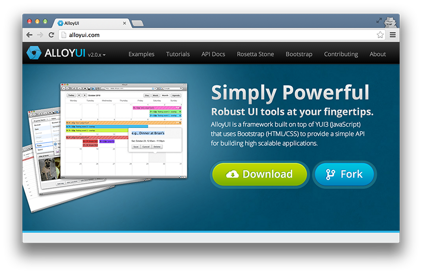

## Why AlloyUI?

* Given the popularity of jQuery, you may be wondering why Liferay chose to build on YUI instead of jQuery.
* Well, Liferay v5.0.x used jQuery and our UI Team already contributed to its core, so what's the reason?
* While jQuery is great for small websites, once you start creating high scalable applications like Java portals you'll need a more robust solution.

> You can still use jQuery or any other JavaScript library in Liferay Portal, but we strongly recommend you to use AlloyUI, since it's integrated with everything. If you use another library, there are chances of your page load slower as it will still load AlloyUI and also need to load your other library.

## Who is using AlloyUI?

* Liferay
* Sesame Street
* Lufthansa
* Cisco
* Marines

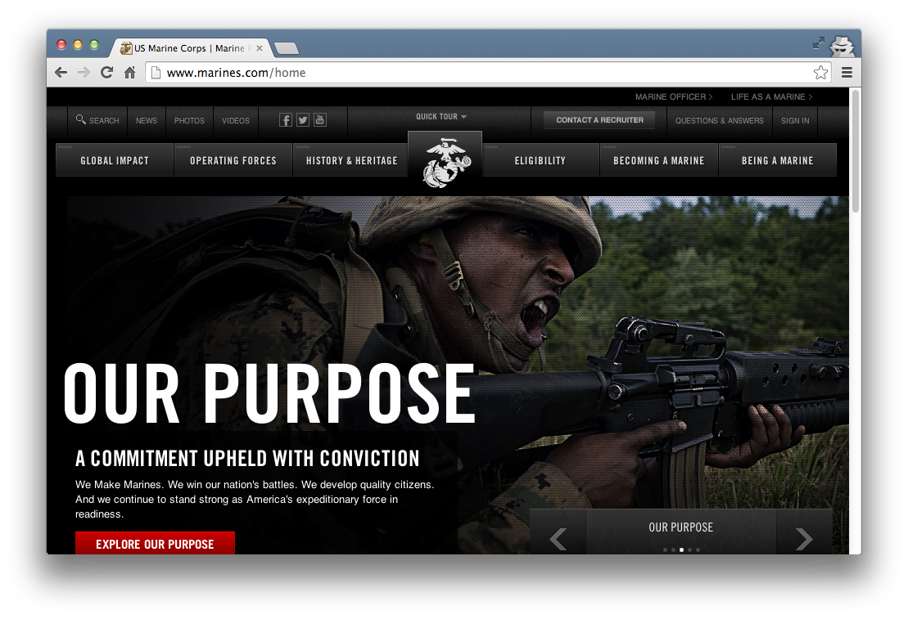

## What is YUI?

The Yahoo! User Interface Library (YUI) is an open-source JavaScript library for building richly interactive web applications using techniques such as Ajax, DHTML, and DOM scripting.

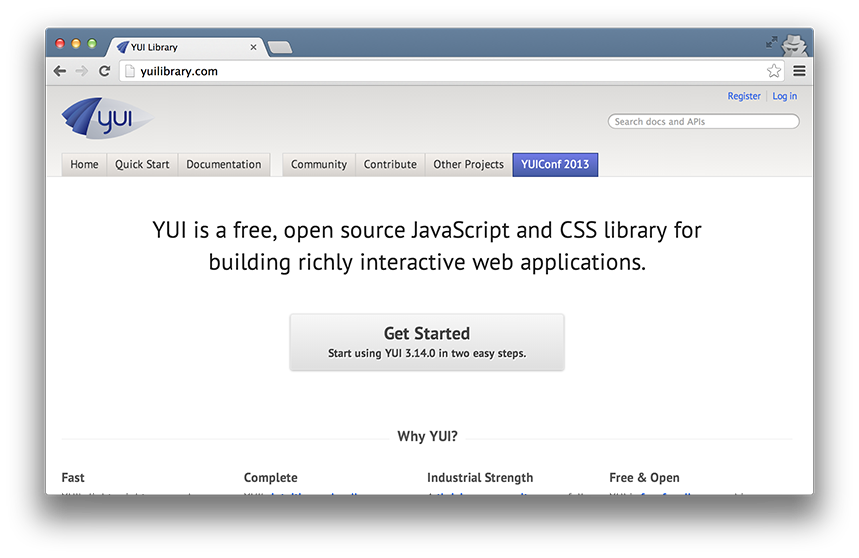

## Why YUI?

* AlloyUI was built on YUI for several reasons. First, YUI facilitates building high quality production-level widgets quickly.
* YUI has an elegant architecture that is very flexible and easy to extend.
* It lends itself for using in small scale as well as large scale projects.

## Who is using YUI?

* Yahoo!
* Flickr
* Walmart
* NFL

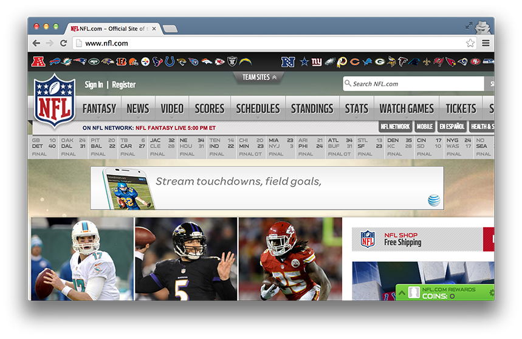

## Project Structure

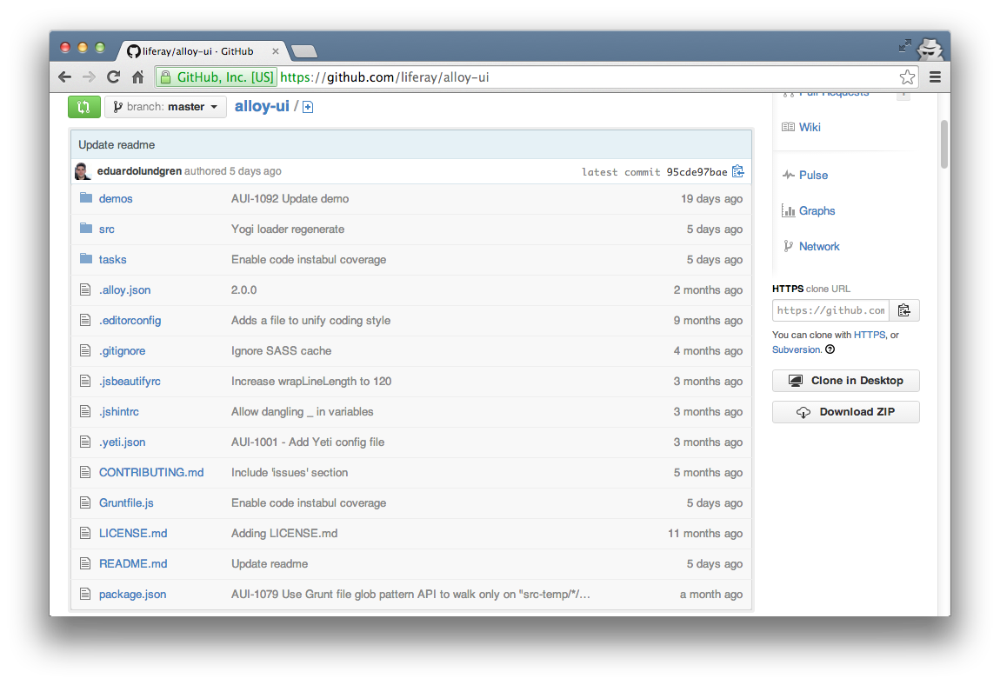

File                | Description
:------------------ | :-------------------------------------------------------------
``demos``           | Contains basic examples of the AlloyUI modules.
``build``           | Contains AlloyUI and YUI generated files, once build task has been run. However, this directory is unnecessary for versioning, so it is ignored (.gitignore).
``src``             | Contains the source code of the AlloyUI modules.
``tasks``           | Contains the source code of the Grunt tasks.
``.alloy.json``     | Specifies all dependencies and some configurations.
``.editorconfig``   | Specifies the coding style for different editors/IDEs
``.jsbeautifyrc``   | Specifies the coding format rules for JSBeautify.
``.jshintrc``       | Specifies the linting configurations for JSHint.
``.yeti.json``      | Specifies the testing configurations for Yeti.
``CONTRIBUTING.md`` | Defines the contributing information for the project.
``LICENSE.md``      | Defines the license agreement for AlloyUI.
``README.md``       | Explains the AlloyUI project.
``package.json``    | Lists all NodeJS dependencies.

For more information visit [AlloyUI GitHub](http://github.com/liferay/alloy-ui) page.

## Who is behind AlloyUI?

### AlloyUI was created in 2009 by:

* Eduardo Lundgren (Brazil)
* Nate Cavanaugh (USA)

### Today there are more contributors, such as:

* Iliyan Peychev (Spain)
* Bruno Basto (Brazil)
* Zeno Rocha (Brazil)


# Liferay

## New features of Liferay UI

Liferay 6.2 brings a set of improvements to the usability and user interface. Several components were rethought, some of them were inherited from AlloyUI 2.0 and others were developed directly on the portal. Other noticeable features are changes in the control panel, the number of pop-ups were reduced and responsive web design support. All that to make the portal more usable and versatile and to allow it to keep growing without increasing the complexity. This tutorial will go through those changes, showing examples and screen-shots to show the end result.

> A good resource in order to have a deep understanding about all the technical changes that happened is to follow the original ticket story on Liferay's issue tracker [https://issues.liferay.com/browse/LPS-34012](https://issues.liferay.com/browse/LPS-34012).

### Twitter Bootstrap

Liferay provides support for [Twitter Bootstrap](http://liferay.github.io/alloy-bootstrap) CSS and HTML markup out of the box. The JavaScript to add behavior to the Bootstrap components are powered by [AlloyUI](http://http://alloyui.com) instead of jQuery. AlloyUI uses a 1:1 translation from Less to [Sass](http://sass-lang.com) available on [alloy-bootstrap](https://github.com/liferay/alloy-bootstrap) repository, also adds minimal extra style definitions for AlloyUI. Some of the benefits of using Bootstrap are:

* Themes built for Liferay can be based on Bootstrap themes. And there are quite a few of them: [wrapbootstrap](https://wrapbootstrap.com), [bootswatch](https://http://bootswatch.com).
* Portlet developers can use the Bootstrap mark-up and Bootstrap components to build a nice looking UI faster. That include using responsive layouts.
* Content authors can use Bootstrap mark-up and styles to create beautiful looking advanced content that looks nice and is consistent with the rest of the UI.

The ability to use Bootstrap for web content is actually a side effect of its use everywhere else, it's definitely a very useful side effect. Twitter Bootstrap already has good documentation that you can access following the links above. Any HTML markup can be copied from [Twitter Bootstrap](http://liferay.github.io/alloy-bootstrap) documentation page and pasted inside Liferay portlets or contents. This facilitates development process and gives security to all layers of developers, from the web designers to those who hates aligning pixels during development.

For instance, when creating a table in a web content, without Bootstrap capabilities it looks like this:

```html
<table border="1" cellpadding="1" cellspacing="1" style="width: 500px;">
```

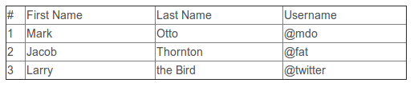

With Bootstrap, the markup is simpler and produces a better result:


```html
<table class="table table-striped table-bordered">
```

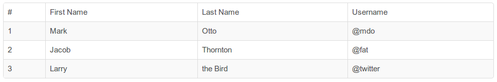

Each of these values of the class attributes provides one feature:

* `table` sets the base styles
* `table-striped` colors alternative rows differently
* `table-bordered` draws the borders around the table

Bootstrap also provides nice effects for images: rounding the borders, making them a circle and adding a polaroid-like frame around it. In order to benefit from this you don't even need to edit the HTML.

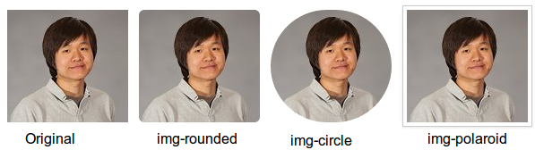

* `img-rounded` for rounded corners
* `img-circle` to get an image with the shape of a circle
* `img-polaroid` to get a nice frame around the image

It's worth mentioning that, before you save the content, the WYSIWYG editor is not aware of Bootstrap, so just getting out of the "Source" mode won't be enough to preview your changes. What you can do is click the "Basic Preview" button at the top of the web content form. For more information check [this blog post](https://www.liferay.com/web/jorge.ferrer/blog/-/blogs/new-in-6-2-bootstrap-even-in-web-content) by Jorge Ferrer.

### Font awesome icons

Liferay Portal 6.2 ships with [its own version](https://github.com/liferay/alloy-font-awesome) of [Font Awesome](http://fortawesome.github.io/Font-Awesome). Font Awesome is a full suite of 361 pictographic icons for easy scalable vector graphics on websites.

### Add panel

The new add panel now provides ability to add content, applications and pages from the same place.

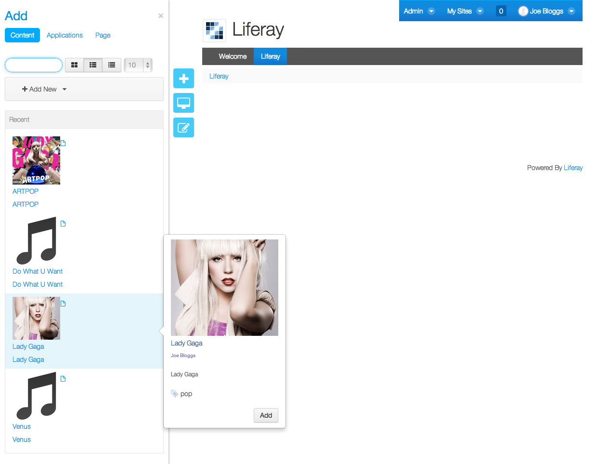

> Add content panel: Lists all recent content and its previews, the user can drag and drop any of them to display on the portal.

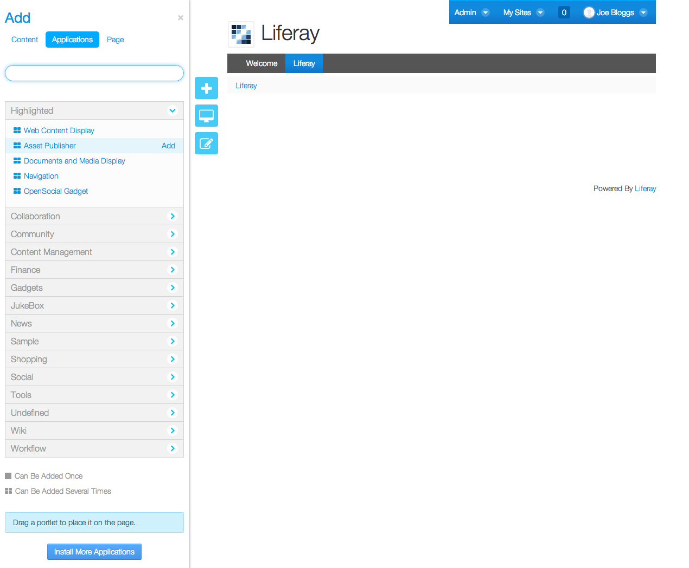

> Add application panel: Lists all available portlets, the user can drag and drop any of them to display on the portal.

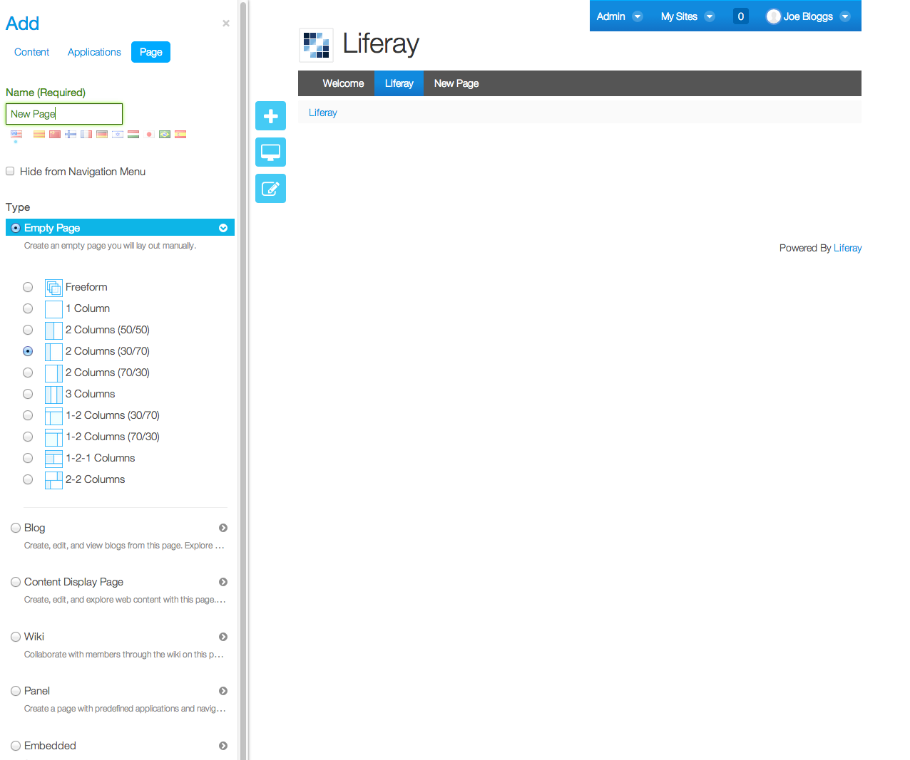

> Add page panel: Pages can be created from this panel, the page type and layout can be selected.

### Navbar

In order to standardize navigation through the portal, one of the new components put in place is the new `<aui:nav-bar>`, `<aui:nav>` and `<aui:nav-item>`. Navbars are responsive meta components that serve as navigation headers for your application or site.

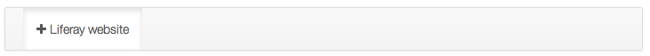

```jsp
<aui:nav-bar>
    <aui:nav>
        <aui:nav-item href="http://liferay.com" label="Liferay website" selected='<%= true %>' />
    </aui:nav>
</aui:nav-bar>
```

> Reference [jukebox/blob/master/sdk/portlets/jukebox-portlet/docroot/html/artists/toolbar.jsp](https://github.com/eduardolundgren/jukebox/blob/master/sdk/portlets/jukebox-portlet/docroot/html/artists/toolbar.jsp)

Available `<aui:nav-bar>` options:

Option              | Description
:------------------ | :-----------------------------------------------------------------
``cssClass``        | The css class to be applied to the nav bar search wrapper element.
``id``              | A custom id to be applied on the nav bar search wrapper element.

Other options can be passed to `<aui:nav>`:

Option              | Description
:------------------ | :-----------------------------------------------------------------
``ariaLabel``       | W3C ARIA label for accessibility, see [ARIA States and Properties](www.w3.org/TR/wai-aria/states_and_properties).
``ariaRole``        | W3C ARIA role for accessibility, see [ARIA States and Properties](www.w3.org/TR/wai-aria/states_and_properties).
``collapsible``     | Add ability to be collapsed (and are toggleable) in mobile views and become horizontal as the available viewport width increases.
``cssClass``        | The css class to be applied to the nav search wrapper element.
``file``            | A custom file path to be used.
``icon``            | Icon to be displayed on the collapsible panel in order to toggle the view.
``id``              | A custom id to be applied on the nav bar search wrapper element.
``searchContainer`` | A SearchContainer instance.
``useNamespace``    | Whether will use the portlet namespace on the element.

Available `<aui:nav-item>` options:

Option                  | Description
:---------------------- | :-----------------------------------------------------------------
``anchorCssClass``      | The css class to be applied to the nav bar search anchor element.
``anchorData``          | Map object to be translated to HTML5 `data-` attributes to the anchor element.
``anchorId``            | A custom id to be applied on the nav bar search anchor element.
``ariaLabel``           | W3C ARIA label for accessibility, see [ARIA States and Properties](www.w3.org/TR/wai-aria/states_and_properties).
``ariaRole``            | W3C ARIA role for accessibility, see [ARIA States and Properties](www.w3.org/TR/wai-aria/states_and_properties).
``cssClass``            | The css class to be applied to the nav item search wrapper element.
``data``                | Map object to be translated to HTML5 `data-` attributes to the wrapper element.
``dropdown``            | Whether can host nested nav items to be displayed as a dropdown menu.
``href``                | The href of the anchor element.
``iconCssClass``        | The icon css class to be displayed next to the label.
``id``                  | A custom id to be applied on the nav bar search wrapper element.
``label``               | The label of the nav item.
``localizeLabel``       | Whether the label should be localized.
``selected``            | Whether the nav item is selected.
``state``               | The state of the nav item, could be `active` or `selected`.
``title``               | The title of the anchor.
``toggle``              | Toggle dropdown menu visibility.
``useDialog``           | Open the anchor href inside a dialog.
``wrapDropDownMenu``    | Wraps dropdown menu with a `<ul>`.

### Navbar dropdown

A `<aui:nav-item>` can be nested in order to produce a dropdown menu, for instance:

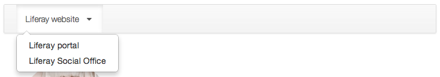

```jsp
<aui:nav-bar>
    <aui:nav>
        <aui:nav-item label="Liferay website" dropdown='<%= true %>'>
            <aui:nav-item href="http://liferay.com" label="Liferay portal" />
            <aui:nav-item href="http://in.liferay.com" label="Liferay Social Office" />
        </aui:nav-item>
    </aui:nav>
</aui:nav-bar>
```

### Advanced search

The new UI of advanced search provides a faster way to expand the search options.

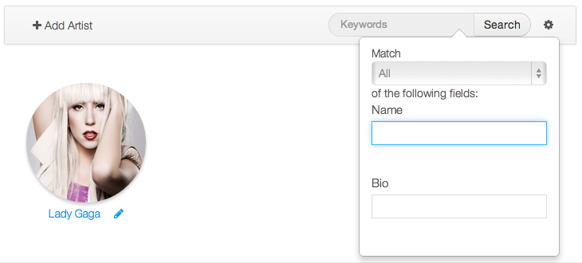

Like on previous versions of Liferay, this functionality uses a `<liferay-ui:search-toggle>` taglib. The search toggle taglib can be placed inside a `<aui:nav-bar>` wrapped by a `<aui:nav-bar-search>` outputting Bootstrap HTML markup in order to provide the look and feel shown above.

```jsp
<aui:nav-bar>
    <aui:nav-bar-search>
        <div class="form-search">
            <liferay-ui:search-toggle buttonLabel="search">
                <aui:fieldset>
                    <aui:input label="name" />
                    <aui:input name="bio" />
                </aui:fieldset>
            </liferay-ui:search-toggle>
        </div>
    </aui:nav-bar-search>
</aui:nav-bar>
```

> Reference [jukebox/blob/master/sdk/portlets/jukebox-portlet/docroot/html/artists/toolbar.jsp](https://github.com/eduardolundgren/jukebox/blob/master/sdk/portlets/jukebox-portlet/docroot/html/artists/toolbar.jsp)

Available `<aui:nav-bar-search>` options:

Option              | Description
:------------------ | :-----------------------------------------------------------------
``cssClass``        | The css class to be applied to the nav bar search wrapper element.
``id``              | A custom id to be applied on the nav bar search wrapper element.
``file``            | A custom file path to be used.
``searchContainer`` | A SearchContainer instance.

```jsp
<aui:nav-bar>
    <aui:nav-bar-search cssClass="pull-right" file="/html/portlet/directory/user_search.jsp" searchContainer="<%= userSearchContainer %>" />
</aui:nav-bar>
```

### Dockbar

Dockbar is a very important portlet for Liferay administrators and developers as it has been evolving by adding more and more features with every new version. All the markup of the Dockbar comes from the Dockbar portlet, on the new version of Liferay it got split into two sections, the first one (top left blue bar) contains navigation menus, the second (right center, the light blue bar) contains the Add, Mobile preview and Edit shortcuts.

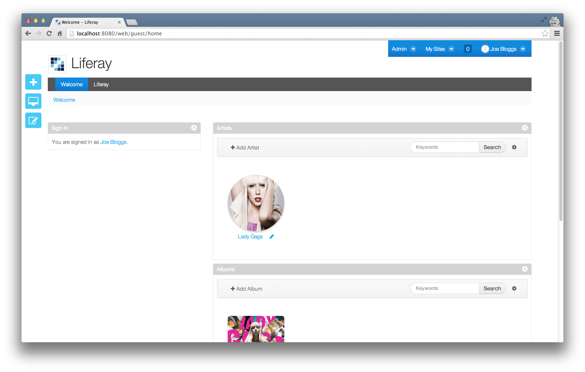

> Keep in mind the two sections of Dockbar comes from the same portlet and share the same HTML markup, the split visual style is all done in CSS by the theme through defining `.dockbar-split` css class, see [https://github.com/liferay/liferay-portal/blob/master/portal-web/docroot/html/themes/classic/css/dockbar.css#L400](https://github.com/liferay/liferay-portal/blob/master/portal-web/docroot/html/themes/classic/css/dockbar.css#L400) for more information.

### Control panel

The Control Panel was introduced in Liferay 5.2 as a way to provide a central location to manage the whole portal, including all of its sites. Previously administrators had to build their own administration UI by manually adding portlets to pages. The goal was achieved with great success and almost all of the feedback has been very positive, although on the new version of Liferay the Control Panel was redesigned to make it more usable and versatile. The main changes were:

* Extract the "My Account" administration out of the Control Panel.
* Extract "Site Administration" outside of the Control Panel

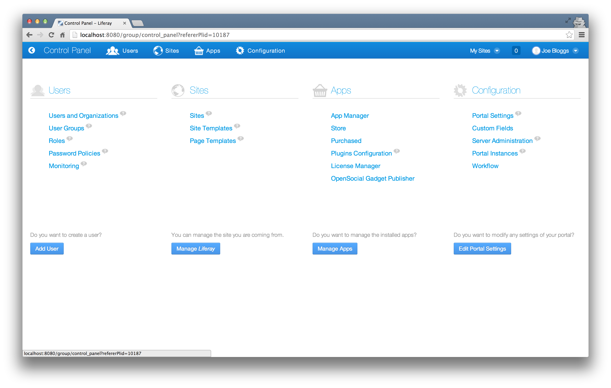

### Form navigator

Form navigator provides ability to divide your content into sections. It uses Bootstrap tabs enhanced by AlloyUI JavaScript.

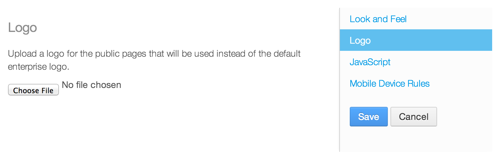

```jsp
<%
String[] categoryNames = new String[] {"Section"};
String[][] categorySections = { new String[] { "look-and-feel", "logo", "javascript", "mobile-device-rules" } };
%>

<liferay-ui:form-navigator
    categoryNames="<%= categoryNames %>"
    categorySections="<%= categorySections %>"
    jspPath="/html/portlet/jukebox/"
    showButtons="<%= true %>"
/>
```

Available `<liferay-ui:form-navigator>` options:

Option                  | Description
:---------------------- | :-----------------------------------------------------------------------------------------------------------------------------
``backURL``             | If the section redirects the page, this url will be used to be the destination when back button is clicked.
``categorySections``    | Divide the categories into sections.
``categoryNames``       | Name of the sections to display, each section name will match to a existing file into the `jspPath` folder.
``displayStyle``        | When `panel` is passed will display a panel style, otherwise displays like tabs.
``formName``            | The form name that wraps the form navigator.
``htmlBottom``          | HTML string to be placed on the bottom of the form navigator.
``htmlTop``             | HTML string to be placed on the top of the form navigator.
``jspPath``             | Path to be used as base path for the sections that requires server side. The file will match with the `categoriesName` value.
``showButtons``         | Whether submit and cancel buttons are shown.

### Modal

The previous Dialog of Liferay was totally revamped and now it is called Modal. It's based on [AlloyUI modal component](http://alloyui.com/examples/modal). In order to instantiate a new modal AlloyUI API could be used directly, although Liferay wraps some functionalities that are pretty handy, such as always keep the dialog maximized and centralized to the page. In order to inherit those presets available on Liferay we recommend to use `Liferay.Util.Window.getWindow`.

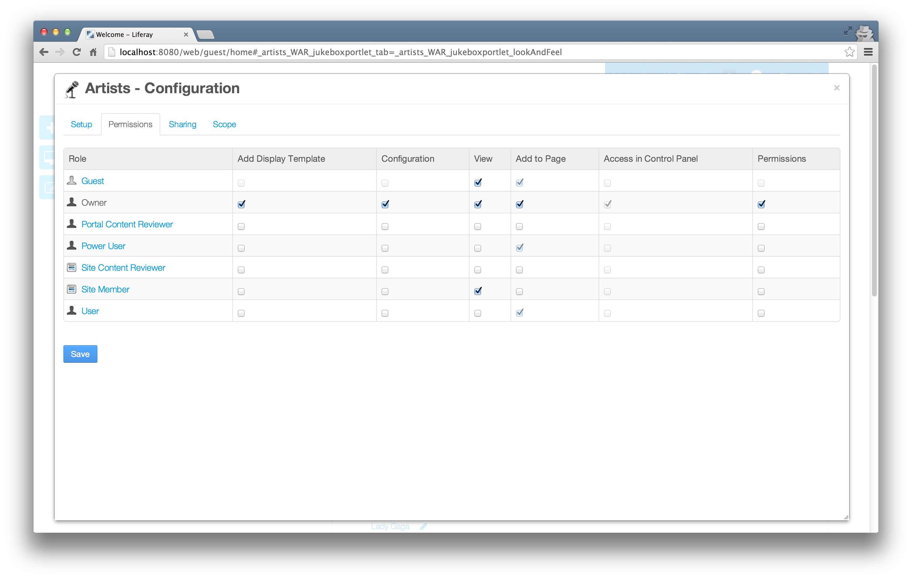

```js
Liferay.Util.Window.getWindow({
    dialog: {
        centered: true,
        cssClass: 'jukebox-portlet',
        height: 300,
        modal: true,
        resizable: false,
        width: 500
    },
    title: Liferay.Language.get('my-portlet')
});
```
Available `Liferay.Util.Window.getWindow` options:

Option                         | Description
:----------------------------- | :----------------------------------------------------------------------
``dialog.autoHeight``          | Whether the modal should automatically fits vertically to the viewport.
``dialog.autoHeightRatio``     | Defines the ratio the modal height should take.
``dialog.autoSizeNode``        | The node used to defines the dimensions of the modal.
``dialog.autoWidth``           | Whether the modal should automatically fits horizontally to the viewport.
``dialog.autoWidthRatio``      | Defines the ratio the modal with should take.
``title``                      | The modal title.

> Note that Liferay Modal extends [AlloyUI modal component](http://alloyui.com/examples/modal), therefore all options from the core component are also available to the `dialog` configuration passed to this API.

### Input localized

A new localized input is also available with a more intuitive ans easy to use interface.

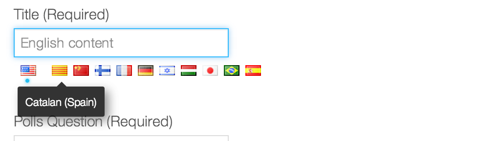

When your entity field is defined as localized on `META-INF/portal-model-hints.xml` the `<aui:input>` taglib detects that and the field will be rendered as a localized input.

```jsp
<aui:input name="title" />
```

### Mobile device preview

We cannot forget the importance of supporting mobile devices for the web portals. Liferay 6.2 comes with an awesome feature of mobile device preview. This feature helps the developer to perform a unit testing of the portal on different types of hand held devices like smart phones, tablets as well as desktop. This feature does not provide an accurate preview but at least major issues can be resolved before the portal is accessed.

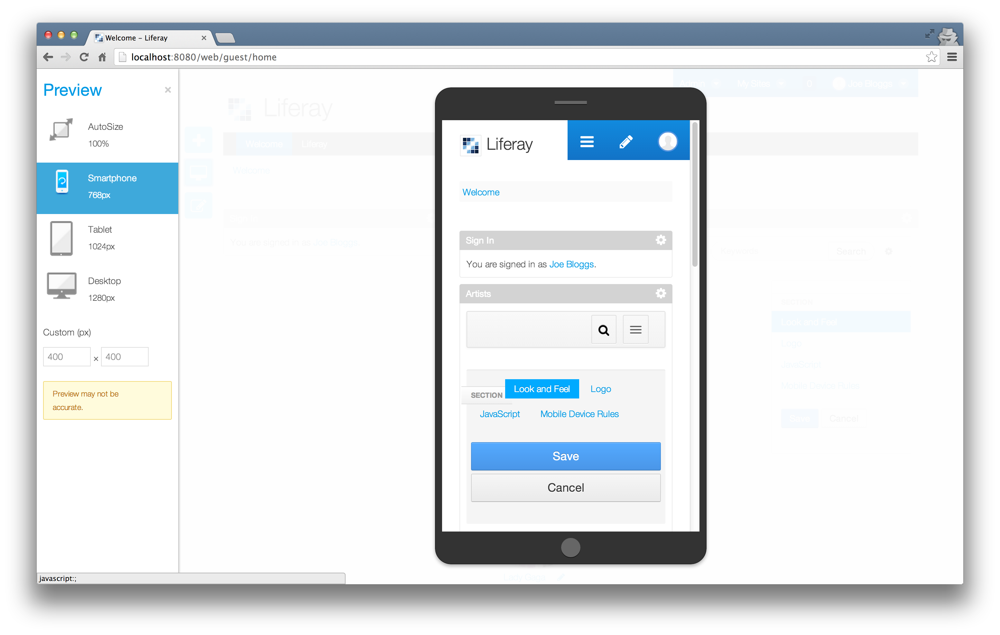

### Search container

The search container feature is available since older Liferay versions and it is responsible for rendering tables using an easy API that integrates with the server side data. On Liferay 6.2 it was restyled and now uses Bootstrap table styles.

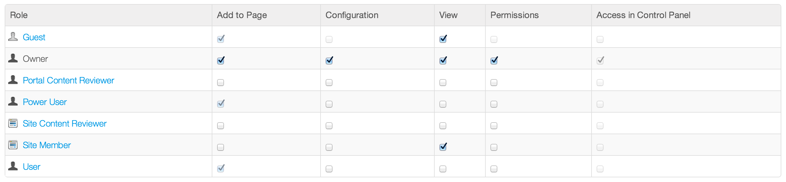

### Input date

The new input date is much more intuitive. It now allows the user to input dates in friendly way.

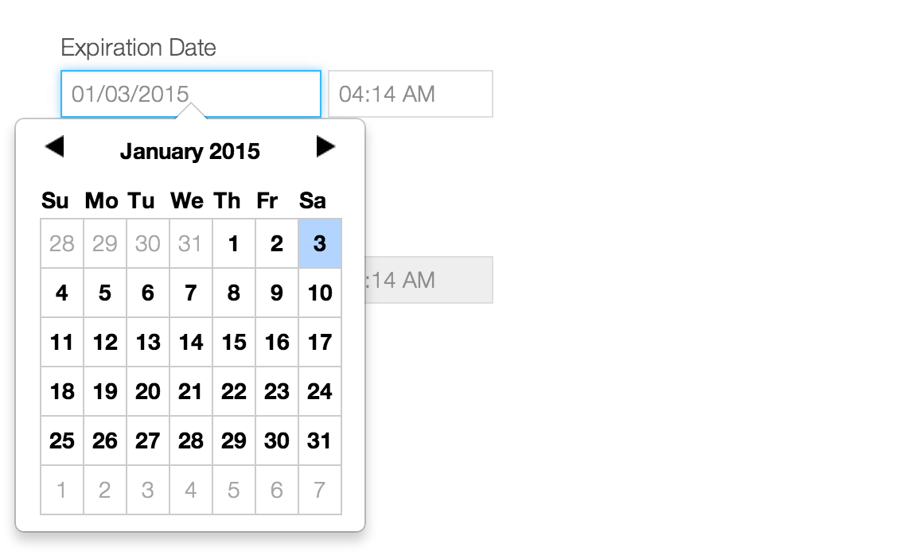

When your entity field is defined as type date on `META-INF/portal-model-hints.xml` the `<aui:input>` taglib detects that and the field will be rendered as a date input. Another way to instantiate input date field is using `<liferay-ui:input-date>` taglib.

```jsp
<liferay-ui:input-date
    dayParam="startDateDay"
    dayValue="5"
    disabled="<%= false %>"
    firstDayOfWeek="1"
    monthParam="startDateMonth"
    monthValue="5"
    name="startDate"
    yearParam="startDateYear"
    yearValue="2014"
/>
```

Available `<liferay-ui:input-date>` options:

Option             | Description
:----------------- | :----------------------------------------------------------------------
``cssClass``       | The css class to be applied to the input date wrapper element.
``disabled``       | Whether the input date should be disabled.
``dayParam``       | Name of the day parameter sent to the server on submit the hosting form.
``dayParamId``     | Id of the day parameter sent to the server on submit the hosting form.
``dayValue``       | Value of the day.
``monthParam``     | Name of the month parameter sent to the server on submit the hosting form.
``monthParamId``   | Id of the month parameter sent to the server on submit the hosting form.
``monthValue``     | Value of the month.
``name``           | Name of the input that holds the friendly date.
``yearParam``      | Name of the year parameter sent to the server on submit the hosting form.
``yearParamId``    | Id of the year parameter sent to the server on submit the hosting form.
``yearValue``      | Value of the year.

### Input time

The new input time is much more intuitive. It now allows the user to input time in friendly way.

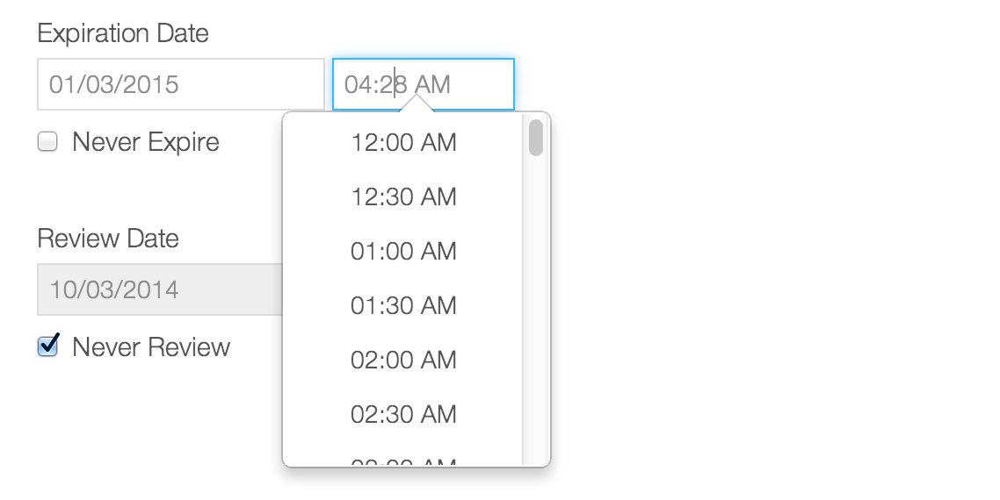

To instantiate input time field the `<liferay-ui:input-time>` taglib could be used.

```jsp
<liferay-ui:input-time
    amPmParam="startDateAmPm"
    amPmValue="<%= 0 %>"
    dateParam="startDateTime"
    dateValue="<%= new Date().getTime() %>"
    disabled="<%= false %>"
    hourParam="startDateHour"
    hourValue="10"
    minuteParam="startDateMinute"
    minuteValue="30"
    name="startTime"
/>
```

Available `<liferay-ui:input-time>` options:

Option              | Description
:------------------ | :----------------------------------------------------------------------
``amPmParam``       | Name of the amPm parameter sent to the server on submit the hosting form.
``amPmValue``       | Value of the amPm.
``cssClass``        | The css class to be applied to the input time wrapper element.
``dateParam``       | Name of the date parameter sent to the server on submit the hosting form.
``dateValue``       | Value of the date.
``disabled``        | Whether the input date should be disabled.
``hourParam``       | Name of the hour parameter sent to the server on submit the hosting form.
``hourValue``       | Value of the hour.
``minuteInterval``  | Value of the amPm.
``minuteParam``     | Name of the minute parameter sent to the server on submit the hosting form.
``minuteValue``     | Value of the minute.
``name``            | Name of the input that holds the friendly date.

### Tooltip


### Popover

The [AlloyUI popover component](http://alloyui.com/examples/popover) is used everywhere in the new Liferay interface. Currently there is no wrapper for the AlloyUI popover API, so feel free to copy the examples from the website and use in Liferay.

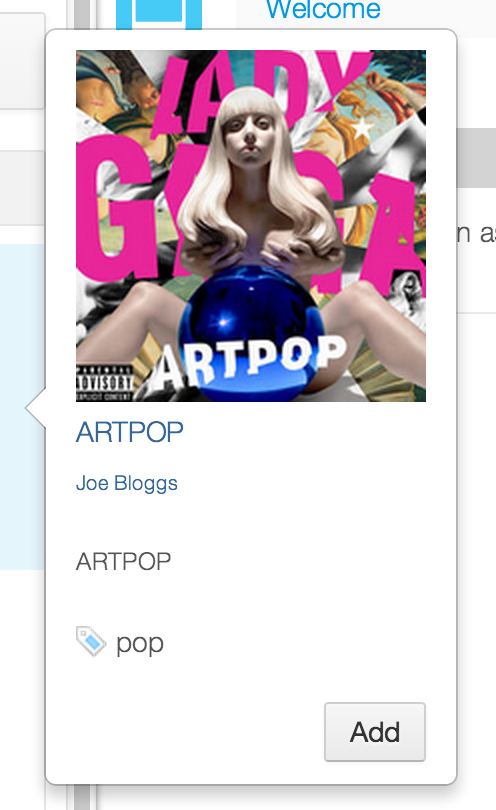

```jsp
<aui:script use="aui-popover">
new Y.Popover({
    align: {
        node: '#triggerElement'
    },
    bodyContent: 'One fine body…',
    headerContent: 'Header content',
    trigger: '#triggerElement'
}).render();
</aui:script>
```

> For more options available on Popover visit [AlloyUI popover component](http://alloyui.com/examples/popover) page.

### Liferay panel

Panel is used to group sections and display an accordion-like interface. A panel usually is wrapped by a `<liferay-ui:panel-container>` taglib containing one or more `<liferay-ui:panel>` items.

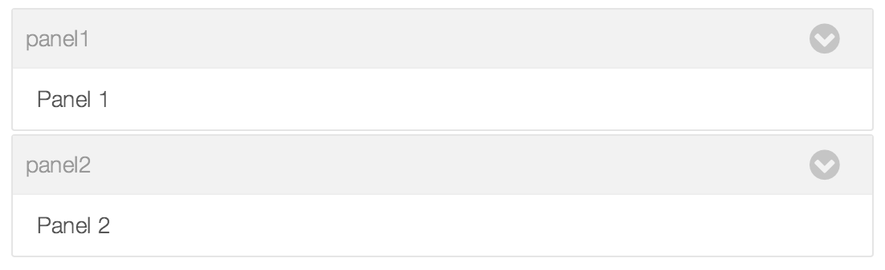

```jsp
<liferay-ui:panel-container extended="<%= true %>" id="jukebox">
    <liferay-ui:panel collapsible="<%= true %>" id="panel1" title="panel1">
        Panel 1
    </liferay-ui:panel>
    <liferay-ui:panel collapsible="<%= true %>" id="panel2" title="panel2">
        Panel 2
    </liferay-ui:panel>
</liferay-ui:panel-container>
```

Another available style is to display a simpler panel, also known as a not extended panel. This could be set through `extended` option.

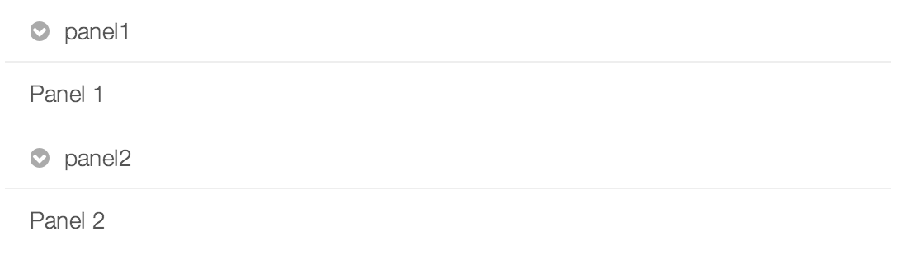

```jsp
<liferay-ui:panel-container extended="<%= true %>" id="jukebox">
    <liferay-ui:panel collapsible="<%= true %>" extended="<%= false %>" id="panel1" title="panel1">
        Panel 1
    </liferay-ui:panel>
    <liferay-ui:panel collapsible="<%= true %>" extended="<%= false %>" id="panel2" title="panel2">
        Panel 2
    </liferay-ui:panel>
</liferay-ui:panel-container>
```

Available `<liferay-ui:panel-container>` options:

Option              | Description
:------------------ | :----------------------------------------------------------------------
``accordion``       | Whether the panel should behave like an accordion.
``cssClass``        | The css class to be applied to the panel container wrapper element.
``id``              | The id of the panel container element.

Available `<liferay-ui:panel>` options:

Option              | Description
:------------------ | :----------------------------------------------------------------------
``accordion``       | Whether the panel should behave like an accordion.
``collapsible``     | Whether the panel should be collapsible.
``cssClass``        | The css class to be applied to the panel wrapper element.
``defaultState``    | Default state of the panel.
``extended``        | Whether the panel should display the extended interface.
``helpMessage``     | The help message displayed when hover the panel header.
``iconCssClass``    | The icon css class to be displayed next to the title.
``id``              | The id of the panel element.
``parentId``        | The id of the panel parent element.
``persistState``    | Whether the panel state should be persisted into the database.
``state``           | Could be `open` or `closed`.
``title``           | The title of the panel.

# Layout templates

In order to organize how the portal is going to display portlets into rows and columns Liferay provides a flexible way to create layout templates. In previous versions of Liferay AlloyUI 1.0 CSS grid system were used. Ad example, let's compare the `2_columns_i.tpl` from Liferay 6.1 with 6.2.

```jsp
<div class="columns-2" id="main-content" role="main">
    #if ($browserSniffer.isIe($request) && $browserSniffer.getMajorVersion($request) < 8)
        <table class="portlet-layout">
        <tr>
            <td class="aui-w50 portlet-column portlet-column-first" id="column-1">
                $processor.processColumn("column-1", "portlet-column-content portlet-column-content-first")
            </td>
            <td class="aui-w50 portlet-column portlet-column-last" id="column-2">
                $processor.processColumn("column-2", "portlet-column-content portlet-column-content-last")
            </td>
        </tr>
        </table>
    #else
        <div class="portlet-layout">
            <div class="aui-w50 portlet-column portlet-column-first" id="column-1">
                $processor.processColumn("column-1", "portlet-column-content portlet-column-content-first")
            </div>

            <div class="aui-w50 portlet-column portlet-column-last" id="column-2">
                $processor.processColumn("column-2", "portlet-column-content portlet-column-content-last")
            </div>
        </div>
    #end
</div>
```

> Liferay 6.1 `2_columns_i.tpl` layout template uses AlloyUI 1.0 CSS grid system, note the usage of `aui-w*`.

On Liferay 6.2 [Twitter Bootstrap's](http://liferay.github.io/alloy-bootstrap) [layouts](http://liferay.github.io/alloy-bootstrap/scaffolding.html#layouts), [grid system](http://liferay.github.io/alloy-bootstrap/scaffolding.html#gridSystem) and [fluid grid system](http://liferay.github.io/alloy-bootstrap/scaffolding.html#fluidGridSystem) are fully available. Other advantage of using Bootstrap layout capabilities is responsive web design features, for instance, on smaller screens, like those of phones, the columns will become fluid and display below each other automatically.

```jsp
<div class="columns-1-2-1" id="main-content" role="main">
    <div class="portlet-layout row-fluid">
        <div class="portlet-column portlet-column-only span12" id="column-1">
            $processor.processColumn("column-1", "portlet-column-content portlet-column-content-only")
        </div>
    </div>

    <div class="portlet-layout row-fluid">
        <div class="portlet-column portlet-column-first span8" id="column-2">
            $processor.processColumn("column-2", "portlet-column-content portlet-column-content-first")
        </div>

        <div class="portlet-column portlet-column-last span4" id="column-3">
            $processor.processColumn("column-3", "portlet-column-content portlet-column-content-last")
        </div>
    </div>

    <div class="portlet-layout row-fluid">
        <div class="portlet-column portlet-column-only span12" id="column-4">
            $processor.processColumn("column-4", "portlet-column-content portlet-column-content-only")
        </div>
    </div>
</div>
```

> Liferay 6.2 `2_columns_i.tpl` layout template uses [Twitter Bootstrap's](http://liferay.github.io/alloy-bootstrap) [layouts](http://liferay.github.io/alloy-bootstrap/scaffolding.html#layouts), [grid system](http://liferay.github.io/alloy-bootstrap/scaffolding.html#gridSystem) and [fluid grid system](http://liferay.github.io/alloy-bootstrap/scaffolding.html#fluidGridSystem), note the usage of `row-fluid` and `span*`.

## Fixed layouts

In order to create fixed layouts, Bootstrap provides a common fixed-width (and optionally responsive) layout with only `<div class="container">` required.

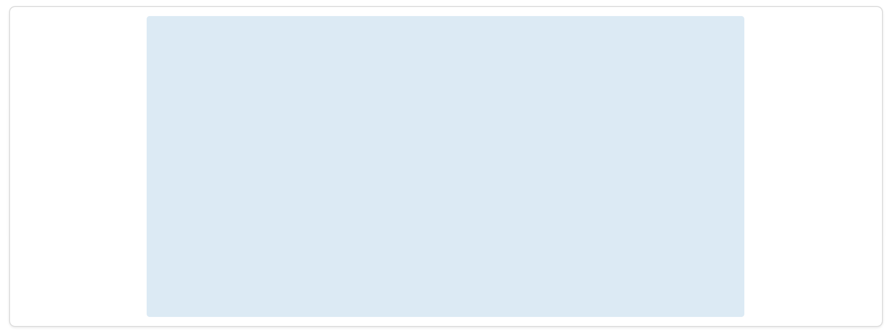

```html
<body>
  <div class="container">
    ...
  </div>
</body>
```

## Fluid layouts

To create a fluid, two-column page with `<div class="container-fluid">` — great for applications and docs.

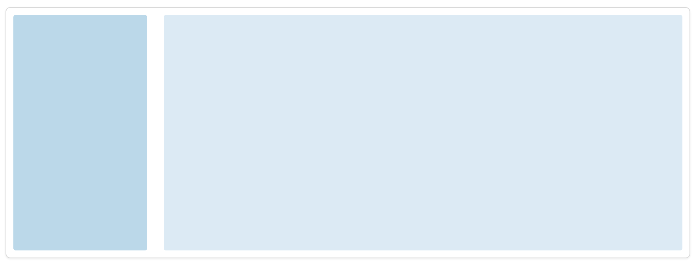

```html
<div class="container-fluid">
  <div class="row-fluid">
    <div class="span2">
      <!--Sidebar content-->
    </div>
    <div class="span10">
      <!--Body content-->
    </div>
  </div>
</div>
```

## Responsive utility classes

For faster mobile-friendly development, use these utility classes for showing and hiding content by device. Below is a table of the available classes and their effect on a given media query layout (labeled by device). They are already included in Liferay portal. For more reference check [Twitter Bootstrap's responsive](http://liferay.github.io/alloy-bootstrap/scaffolding.html#responsive) documentation.

Class                 | Phones (767px and below) | Tablets (979px to 768px) | Desktops (Default)
:-------------------- | :-------------------------------------------------------------------
`.visible-phone`      | **Visible**              | Hidden                   | Hidden
`.visible-tablet`     | Hidden                   | **Visible**              | Hidden
`.visible-desktop`    | Hidden                   | Hidden                   | **Visible**
`.hidden-phone`       | Hidden                   | **Visible**              | **Visible**
`.hidden-tablet`      | **Visible**              | Hidden                   | **Visible**
`.hidden-desktop`     | **Visible**              | **Visible**              | Hidden

## How to use layout features on portlets?

Liferay popular `<aui:layout>`, `<aui:column>` are deprecated on Liferay 6.2 since they still use old AlloyUI grid system.

```jsp
<aui:layout>
    <aui:column columnWidth="25">
        <liferay-util:include page="/html/portlet/jukebox/column1.jsp" />
    </aui:column>
    <aui:column columnWidth="75">
        <liferay-util:include page="/html/portlet/jukebox/column2.jsp" />
    </aui:column>
</aui:layout>
```

In order to have full advantage of Bootstrap on your layouts you should use the brand new `<aui:row>` and `<aui:col>` taglibs, which provides a very similar API, see the following example of the new taglibs.

```jsp
<aui:row>
    <aui:col width="25">
        <liferay-util:include page="/html/portlet/jukebox/column1.jsp" />
    </aui:col>
    <aui:col width="75">
        <liferay-util:include page="/html/portlet/jukebox/column2.jsp" />
    </aui:col>
</aui:row>
```

Available `<aui:row>` options:

Option              | Description
:------------------ | :-----------------------------------------------------------------
``cssClass``        | The css class to be applied to the row wrapper element.
``id``              | A custom id to be applied on the row wrapper element.
``fluid``           | Whether the column should be `.row-fluid`.

Available `<aui:col>` options:

Option              | Description
:------------------ | :-----------------------------------------------------------------
``cssClass``        | The css class to be applied to the column wrapper element.
``id``              | A custom id to be applied on the column wrapper element.
``offset``          | Move columns to the right using `.offset*` classes.
``offsetWidth``     | Move the columns to the right using percentage, it converts the percentage to the closest `.offset*` value.
``span``            | As this is a 12-column grid, each `.span*` spans a number of those 12 columns, and should always add up to 12 for each row (or the number of columns in the parent).
``width``           | Width in percentage that the column should be, it converts the percentage to the closest `.span*` value.

# Building a theme

Liferay and AlloyUI uses a 1:1 translation from Less to [Sass](http://sass-lang.com) available on [alloy-bootstrap](https://github.com/liferay/alloy-bootstrap) repository, also adds minimal extra style definitions. The new Liferay classic theme uses Bootstrap core files in order to be generated. This flexibility brings powerful capabilities to Liferay since during the theme development it is possible to redefine parts of Bootstrap core before compile the generated CSS file, for example, tweak the variables  on Bootstrap file that defines base colors for Bootstrap.

## Theme architecture

## Create a theme

Navigate to the material on the folder `liferay-client-park-group/liferay-plugins-sdk-6.2.0/themes/park-theme/` previously created for you.

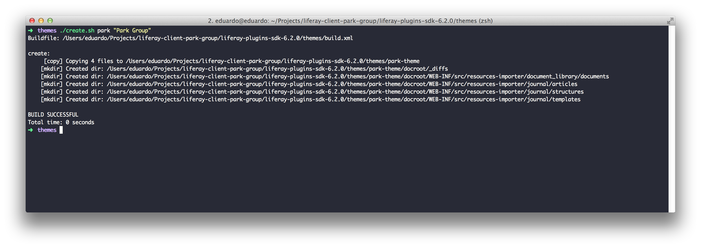

Deploy the theme in order to Liferay copy the files from the parent theme. Once it's deployed the theme folder will look like this:

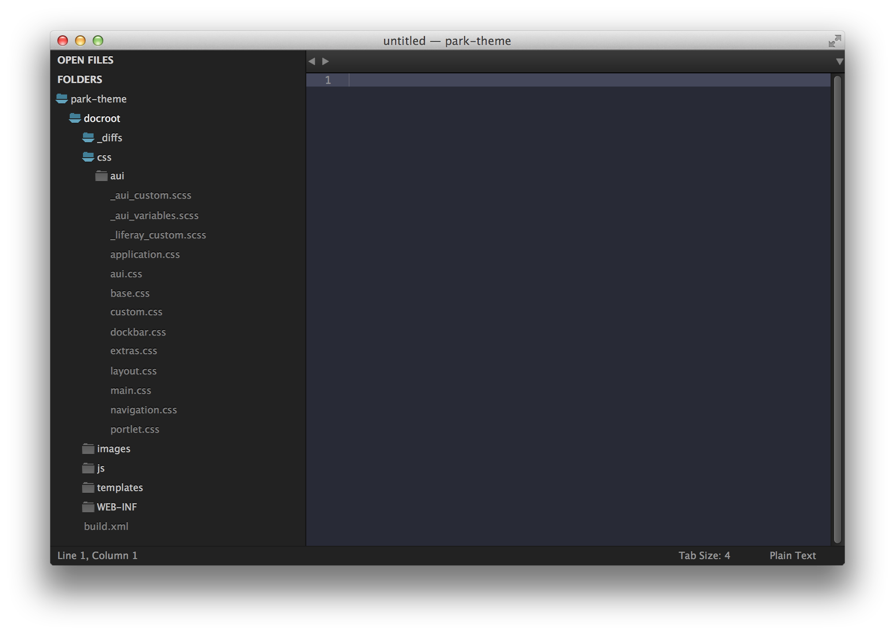

File                        | Description
:-------------------------- | :-----------------------------------------------------------------------------------------------------
``aui``                     | This contains a copy of [AlloyUI Twitter Bootstrap's](http://liferay.github.io/alloy-bootstrap) theme.
``_aui_custom.scss``        | Custom file to overwrite AlloyUI CSS classes.
``_aui_variables.scss``     | Custom file to overwrite AlloyUI theme variables.
``_liferay_custom.scss``    | Custom file to overwrite Liferay CSS classes.

It's possible to customize the theme in the SASS level, that means that you can overwrite, extend or customize any of the AlloyUI CSS classes, including Bootstrap's. Let's see it in action.

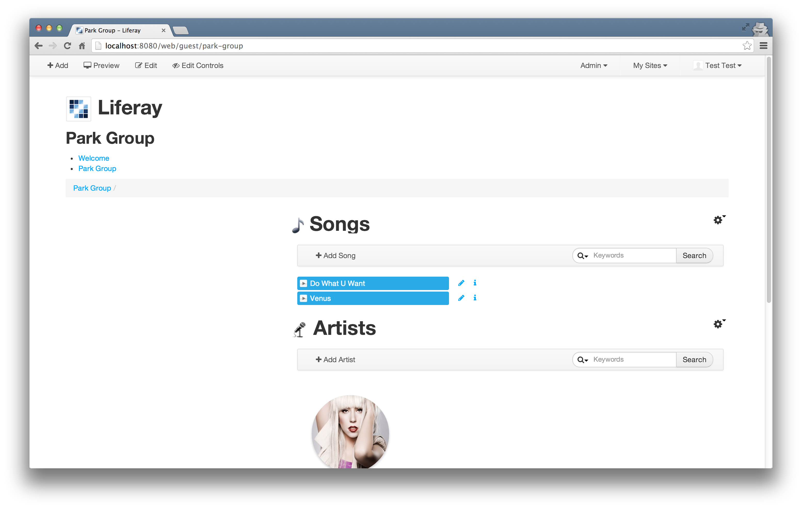

On the created theme, copy `_aui_variables.scss` to `_diffs/css/` folder and modify the value of the following two variables.

```scss
...
$navbarBackground: #FF0000;
$navbarBackgroundHighlight: #FF0000;
...
```

Redeploy your theme and notice that it redefined the background color of all navbar components. You can feel free to use any [Sass](http://sass-lang.com) feature to extend the existing functionality available on the theme.

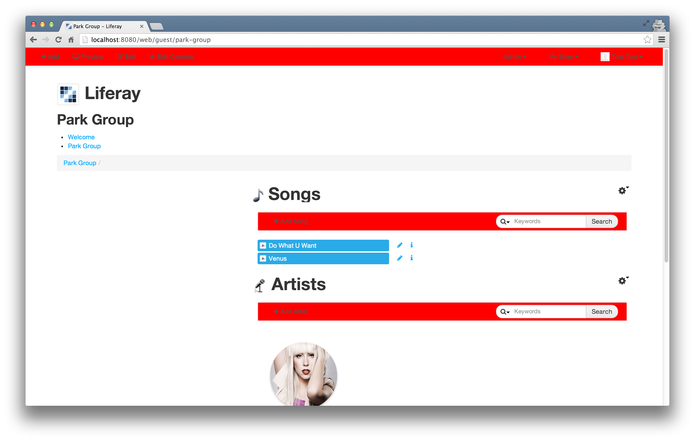

# Upgrade secrets for Liferay UI

Liferay 6.2 uses Twitter® Bootstrap-based theming for a slick, vibrant look and feel with instant access to the Twitter® Bootstrap (Bootstrap) theme library. But there are a number of changes that needed to be made to AlloyUI in order to accommodate and properly use Bootstrap. In this section, we'll explain the reasoning behind the changes to AlloyUI and we'll explain how to migrate plugins to use AlloyUI 2.0 and Bootstrap.

Here is an outline of the types of changes you'll need to understand and handle in migrating your plugins:

* Removal of the “aui-” prefixes from all classes
* Module deprecations
* CSS classes replaced with Bootstrap equivalents
* Component output and markup changes
* Icon removals, in favor of using Bootstrap icons

The good news is that Liferay provides a tool for making these changes. But before we show you that tool, we'll explain the impact of each of these AlloyUI changes with respect to Liferay 6.1 plugins. First, let's look at the removal of the `aui-` class name prefix.

## Removal of the “aui-” Prefix from All Classes

The `aui-` class prefix was hindering developers from copying and pasting examples from Bootstrap's site into their Liferay plugin code. So we've removed the prefix from all of AlloyUI's CSS and JavaScript classes. You'll need to update any references to the classes that have been removed. For example, you should remove the 'aui-' prefix from the class reference `.aui-ace-autocomplete`, converting the reference to `.ace-autocomplete`. There are plenty more class references like this one that you'll need to update.

Next, let's consider the modules that have been deprecated in AlloyUI 2.0.

## AlloyUI Module Deprecations

Because extensive changes were needed for a number of AlloyUI modules, many of the original modules were deprecated. In some cases the original modules were deprecated with no replacement; in other cases we used the original name for the new module implementation and have simply renamed the old module by adding a `-deprecated` suffix to it. AlloyUI 2.0's module API is documented at [http://alloyui.com/api](http://alloyui.com/api), but we've listed the deprecated modules here:

Module                                             |
:------------------------------------------------- |
aui-autocomplete-deprecated |
aui-autosize-deprecated |
aui-button-item-deprecated |
aui-chart-deprecated |
aui-color-picker-base-deprecated |
aui-color-picker-deprecated |
aui-color-picker-grid-plugin-deprecated |
aui-color-util-deprecated |
aui-data-set-deprecated |
aui-datasource-control-base-deprecated |
aui-datasource-control-deprecated |
aui-datepicker-base-deprecated |
aui-datepicker-deprecated |
aui-datepicker-select-deprecated |
aui-delayed-task-deprecated |
aui-dialog-iframe-deprecated |
aui-editable-deprecated |
aui-form-base-deprecated |
aui-form-combobox-deprecated |
aui-form-deprecated |
aui-form-field-deprecated |
aui-form-select-deprecated |
aui-form-textarea-deprecated |
aui-form-textfield-deprecated |
aui-input-text-control-deprecated |
aui-io-deprecated |
aui-io-plugin-deprecated |
aui-io-request-deprecated |
aui-live-search-deprecated |
aui-loading-mask-deprecated |
aui-overlay-base-deprecated |
aui-overlay-context-deprecated |
aui-overlay-context-panel-deprecated |
aui-overlay-deprecated |
aui-overlay-manager-deprecated |
aui-overlay-mask-deprecated |
aui-panel-deprecated |
aui-resize-base-deprecated |
aui-resize-constrain-deprecated |
aui-resize-deprecated |
aui-scroller-deprecated |
aui-simple-anim-deprecated |
aui-skin-deprecated |
aui-state-interaction-deprecated |
aui-swf-deprecated |
aui-template-deprecated |
aui-textboxlist-deprecated |
aui-tooltip-deprecated |
aui-tpl-snippets-base-deprecated |
aui-tpl-snippets-checkbox-deprecated |
aui-tpl-snippets-deprecated |
aui-tpl-snippets-input-deprecated |
aui-tpl-snippets-select-deprecated |
aui-tpl-snippets-textarea-deprecated |

Note, some of these modules have new implementations with the same name, excluding the suffix '-deprecated'. Liferay's AlloyUI Upgrade Tool tacks the '-deprecated' suffix onto module references it finds. It's up to you to migrate to the new AlloyUI 2.0 modules.

Next, let's consider the CSS classes that have been replaced by Bootstrap equivalent components.

## CSS Classes Replaced with Bootstrap Equivalents

Many of the CSS classes used in AlloyUI 1.5 were replaced with Bootstrap classes or were removed because they didn't blend well with Bootstrap. You may find this with CSS classes in your plugins. Consider replacing your classes with Bootstrap's CSS classes. See [http://liferay.github.io/alloy-bootstrap/base-css.html](http://liferay.github.io/alloy-bootstrap/base-css.html) for more information on these CSS classes.

Next, let's consider the component output and markup changes in AlloyUI 2.0.

## Component Output and Markup Changes

AlloyUI 2.0 introduces appealing new changes in its output and some practical changes to its markup. These changes help facilitate building UIs with a consistent look and feel, and they help improve UI performance. You can try many of these component changes via the pages of examples and tutorials found on [http://alloyui.com/](http://alloyui.com). You'll have to take a look at the [AlloyUI 2.0 API documentation](http://alloyui.com/api) to understand a number of the markup changes–but here are some common changes:

* Buttons work a little differently in AlloyUI 2.0. By default, they now submit the form. If you don't want that default behavior, you should prevent it by using a DOM event call like this: `event.domEvent.preventDefault();`.
* In A.Modal, you now use `close-panel` instead of the old `aui-btn-cancel` tablib.
* To delegate selectors for buttons, simply use `.selector-button` instead of `.selector-button input`.

There are plenty more changes, but at least these are a few to get you started. And remember that the Liferay AlloyUI Upgrade Tool–that we'll introduce shortly–will help you out as well. Next, let's consider the changes in the icons available.

## Icon Removals, in Favor of Using Bootstrap Icons

We replaced many icons with those provided by Bootstrap. We also added icons from the Font Awesome project. These icons look great and provide a consistent look and feel throughout Liferay and our plugins. You'll need to update your plugin's references for icons that have been removed. In cases where you use the `liferay:icon` taglib, you simply need to change the value of its image attribute to that of a different icon. Consider using the new icons available in Bootstrap, such as their [icons from Glyphicons](http://liferay.github.io/alloy-bootstrap/base-css.html#icons).

We've given you the **dime** tour of the types of changes you'll need to accommodate in the plugins you're migrating from Liferay 6.1 to 6.2, but to really jump-start your migration process, we'll show you Liferay's AlloyUI Upgrade Tool. So, put on your work gloves and get ready to power through migrating your plugins!

For more information follow the wiki page for [AlloyUI 2.0 / Bootstrap Migration](https://www.liferay.com/pt/documentation/liferay-portal/6.2/development/-/ai/alloyui-2-0-bootstrap-migration-liferay-portal-6-2-dev-guide-02-en).

# Upgrading Plugins with the Liferay AlloyUI Upgrade Tool

## What is it and why it would be useful

After the migration to Alloy 2.0 and Bootstrap, there are some changes, which have to be done in order to run successfully the already existing Portlets in Liferay Portal 6.2. Most of these changes should be done in JS, CSS and JSP files.
To be more easier to upgrade the code, we have created this tool. Depending on your code, it will do 80-100% of the needed changes.

## Running from NPM

1. Install [NodeJS](http://nodejs.org/download/).

2. Install module:

  ```bash
$ [sudo] npm install -g laut
  ```

3. Execute:

  ```bash
$ laut -f projects/liferay/liferay-plugins
  ```

Where `projects/liferay/liferay-plugins` is the directory which contains the Portlets which have to be migrated.

Once you run it, the tool will change what is possible. As a developer, you will have to review the changes and accept or reject them. Even if you reject them, they will still be useful as a hint that something won't work in this case and you will have to apply manually a change there.

## Supported options

Liferay AUI Upgrade Tool supports various options:

  ```bash
$ laut --help

  Usage: laut.js [options]

  Options:

    -h, --help                   output usage information
    -f, --file [file name]       The file(s) to process.
    -e, --ext [file extensions]  The file extensions which should be processed. Defaults to "js, jsp, jspf, css".
    -V, --version                output the version number
  ```

## What it does

1. Removes the `aui-` prefix from CSS classes in CSS, JS and JSP pages.
2. Adds `-deprecated` suffix to all deprecated modules in AlloyUI 2.0. The user can configure these, they are described in JSON format in `assets/deprecated-modules.json` file.
3. Renames CSS classes. There are some classes, which should be renamed. The user can configure these, they are described in JSON format in `assets/css-classes.json` file.
4. Replaces the `inputCssClass` attribute in `<aui:input>`. `inputCssClass` is no more used. If there is `cssClass` attribute in `<aui:input>`, it adds the classes in `inputCssClass` after those in `cssClass`, otherwise it renames `inputCssClass` to `cssClass`
5. Replaces `.selector-button input` in all places, where we attach delegate events (or single listeners via .on) with `.selector-button`.
6. Changes `handler: function(...`  to `on : { click: function(... }`. This is usually used on adding children to AUI Toolbar. See [here](https://github.com/ipeychev/liferay-aui-upgrade-tool/issues/9) for more information.
7. Replaces all occurences of new `A.Dialog` with `Liferay.Util.Window.getWindow`.
8. Adds `<portlet:namespace />` to `name` attribute of `input` elements if not already namespaced.

## How fast is the tool

The whole directory which contains the [Liferay Plugins](https://github.com/liferay/liferay-plugins/tree/master/portlets) is being processed for **3,55sec** on Apple Mac with 2.8 Ghz Intel Core i7 processor and 16 GB RAM.